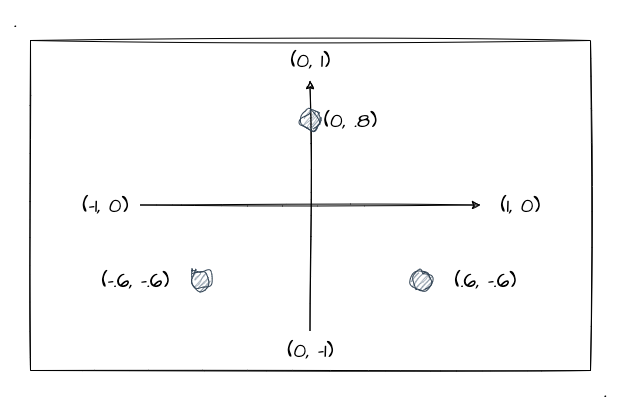
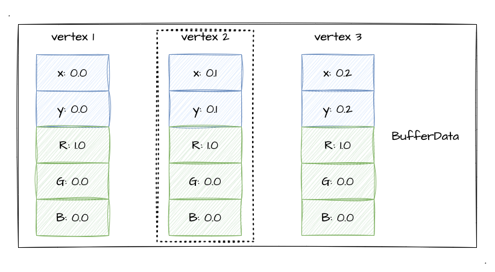
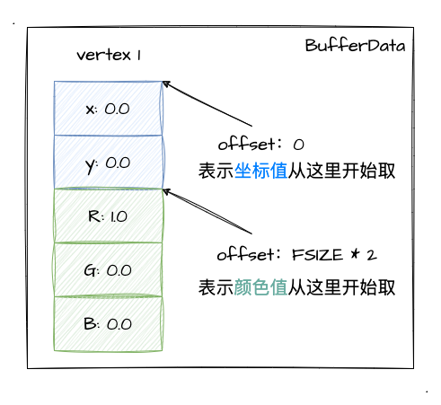

# 1. 绘制彩色的三角

回顾上个章节的学习，我们了解如何用 GLSL 写基本的着色器，并且了解了如何绘制一些基础的 2D 图形了。那在上一章的最后一节，我在演示 `TRIANGLE` 绘制效果的时候采用了混色的三角形去实现一些基础图形的绘制。所以！这一节我们将沿着这个方向，探索如何绘制出一个渐变色的三角形。

## 多个缓冲区对象

回顾一下我们上一章节的示例程序：

:::demo
second/6_3
:::

很明显，这个示例程序中，我们需要动态传递给着色器的数据不仅仅是顶点坐标，还有颜色值。而之前我们学习缓冲区对象的时候，只有一种数据类型（顶点坐标）分配到着色器的 `attribute` 变量中，那显然是不足以满足我们现在的需求的，所以我们可以通过创建多个缓冲区对象来实现这样的需求。

首先分析一下着色器的代码：
```js
const vertexCode = `
  // 顶点坐标数据
  attribute vec4 a_Position;
  // 颜色数据
  attribute vec4 a_Color;
  // varying 变量传递到片元着色器
  varying vec4 v_Color;

  void main () {
    gl_Position = a_Position;
    v_Color= a_Color;
  }
`

const fragmentCode = `
  precision mediump float;
  // 颜色值变量
  varying vec4 v_Color;

  void main () {
    gl_FragColor = v_Color;
  }
`
```
简单来说，顶点着色器中不仅动态接收**坐标数据**，并且接收了**颜色数据**，再通过 `varying` 变量将颜色值传递到片元着色器。（有需要回顾 [`varying` 变量](/content/二、WebGL基础/4.%20绘制动态颜色点.html#varying-变量)的内容可以先回顾一下再接着看本文）

那既然知道我们现在需要传递**两种类型的顶点数据**给到着色器，那我们需要怎么做呢？第二章我们学习缓冲区对象的时候只给顶点着色器分配了一个缓冲区对象（顶点坐标），那现在我们尝试给它分配第二个缓冲区对象！

示例我们简单一点，就画个三角形就好了，沿用第二章第5小节的坐标，如下图：



首先这是本次绘制的顶点坐标数据：
```js
const vertices = new Float32Array([
  -.6, -.6,
  0., .8,
  .6, -.6,
])
```

接着，我们给颜色值也指定一个缓冲区数据，本次绘制我们就按照 `rgb` 的顺序给颜色值就好了，这是颜色值的数据：
```js
const colors = new Float32Array([
  1., 0., 0., 1., // 红色
  0., 1., 0., 1., // 绿色
  0., 0., 1., 1., // 蓝色
])
```

在定义好坐标、颜色的数据后，我们就可以着手缓冲区对象了，那我们简单回顾一下使用缓冲区对象的五步骤：
1. 创建缓冲区对象
2. 绑定缓冲区对象到 `target`
3. 分配缓冲区数据
4. 将缓冲区分配到 `attribute` 变量
5. 开启 `attribute` 变量

其实多个缓冲区对象，也就是按照上述步骤，多次执行而已。简单来说，我们可以把上述步骤进行一个封装，比如封装成一个 `createBuffer` 的函数，分多次调用。下面是实现的伪代码：
```js
// 创建缓冲区封装
const createBuffer = () => {
  const buffer = gl.createBuffer() // 创建缓冲区对象
  gl.bindBuffer(target, buffer) // 绑定缓冲区对象到 target
  gl.bufferData(target, bufferData, gl.STATIC_DRAW) // 分配缓冲区数据
  gl.vertexAttribPointer(attribute, size, gl.FLOAT, false, 0, 0) // 将缓冲区分配到 attribute 变量
  gl.enableVertexAttribArray(attribute) // 开启 attribute 变量
}

// 创建顶点坐标数据的缓冲区
createBuffer(vertex)
// 创建颜色数据的缓冲区
createBuffer(color)
// 创建 xxx 的缓冲区
createBuffer(xxx)
```

由此一来，我们通过多种缓冲区对象实现了不同种类数据的传递。每当我们执行 `gl.drawArrays` 进行绘制时，各种数据将**按照其在缓冲区中的顺序一一传递到对应顺序的顶点着色器的 `attribute` 变量**中。我们可以通过下图将其表示出来：


那么接下来，我们直接通过示例程序来看看绘制的效果把：

:::demo
third/1_1
:::

由上述示例程序可以看到，我们成功地实现了一个红绿蓝的**三色三角形**，所以我们可以通过多个缓冲区对象来实现多种顶点数据到顶点着色器之间的分配和传递！并且举一反三，我们不管是坐标数据、颜色数据、还是说尺寸数据等等，都可以通过存放到多个缓冲区对象中一一传递到**顶点着色器**对应的 `attribute` 变量里。

那么，除了创建多个缓冲区对象来实现这样的需求，还有没有其他的方案呢？我们接着往下看。

## `gl.vertexAttribPointer`的神奇参数

还记得上一章最后一节的一个示例程序中我提到的步进参数吗？这里我们就开始讲讲它。回顾之前我们讲缓冲区的时候，使用了 `gl.vertexAttribPointer` 这一个 api 讲缓冲区的数据分配到 `attribute` 变量，但是当时我们仅仅只介绍了前两个参数，那接下来我们继续了解其他的参数！

为什么说是神奇的参数？因为这些参数，是决定了我们可以将多种类数据都统一存放在一个 缓冲区对象 中的因素。此时，我再次贴出 [MDN-gl.vertexAttribPointer](https://developer.mozilla.org/en-US/docs/Web/API/WebGLRenderingContext/vertexAttribPointer) api 用法地址，这次我们将认识它的全部参数用法！

| 参数      | 参数值说明                                                                                  |
|-----------|---------------------------------------------------------------------------------------------|
| index     | `attribute` 变量                                                                            |
| size      | 每个顶点分配到的**缓冲区数据的个数**，值范围是`[1-4]`                                       |
| type      | 数据格式，如 `gl.FLOAT`、`gl.BYTE`                                                          |
| normalize | boolean值，指是否将非浮点数转换时归一化到`[0, 1]` 或者`[-1, 1]`区间（对于 `gl.FLOAT` 无效） |
| stride    | 指定**两个顶点之间的字节数**，默认 `0`                                                      |
| offset    | 指定**缓冲区数据的偏移量(单位是字节)**，如果是最开始的位置则为 `0`                          |

从表格中的参数值说明中，我们大概都可以猜到，本节的重点是 `stride` 和 `offset` 这两个参数值，只要我们理解了它们的作用，就很好上手写代码实现彩色的三角形了。emm，表格中的简短描述可能比较难懂，我们借助图文来进一步理解！

### 1. `stride`参数详解

我们首先看看描述：
> 指定**两个顶点之间的字节数**(步进参数)，默认 `0`。

何为两个顶点之间的字节数？我们通过一个图来将其进行表示：



如上图所示，buffer 中有三个顶点数据，每个顶点数据**不仅有坐标数据，还有颜色值 `rgb` 数据**。然后我用虚线将 `vertex 2` 圈起来了，因为它处于另外两个顶点的中间，所以**它的字节数就等于两个顶点之间的字节数**！我们不难发现，这个字节数其实就是等于**每个顶点自身的字节数**。

好了，那既然明确了**两个顶点之间**，那怎么求字节数呢？这里我们同样先来看一个新的属性：[TypedArray.BYTES_PER_ELEMENT](https://developer.mozilla.org/en-US/docs/Web/JavaScript/Reference/Global_Objects/TypedArray/BYTES_PER_ELEMENT) 的介绍。

其实我们只看它文档的第一句介绍就能明白了：

> The `TypedArray.BYTES_PER_ELEMENT` static data property represents the size in bytes of each element in a typed array.

这个 强类型数组中**每个元素所占用的字节数** 不正是我们需要找的东西吗？那回到上面的图例中，我们的 `stride` 参数不就是等于 **`顶点数据个数 * 每个元素所占用的字节数`** 吗？我们将上述图示的案例转化成代码表述，大家就能有很深刻的理解了：

```js
const verticesColors = new Float32Array([
  0.0, 0.0, 1.0, 0.0, 0.0, // 第一个点包括坐标、颜色rgb
  0.1, 0.1, 1.0, 0.0, 0.0, // 第二个点包括坐标、颜色rgb
  0.2, 0.2, 1.0, 0.0, 0.0, // 第三个点包括坐标、颜色rgb
])
// 每个元素占用的字节数
const FSIZE = verticesColors.BYTES_PER_ELEMENT
// 每个顶点数据总共有 5 个浮点数
stride参数 = FSIZE * 5
```

首先我们看 `verticesColors` 这个类型数组，里面每一行就是一个顶点的所有数据，其中包括了坐标数据（前两个）、颜色数据（后三个）。

再看我定义的常量 `FSIZE`，它就是 `TypedArray.BYTES_PER_ELEMENT` 的结果值，所以它代表了 `verticesColors` 里平均单个元素所占用的字节数。

最后，`stride` 步进参数是**两个顶点之间的字节数**，所以它的值就等于 `FSIZE  * 5`。

### 2. `offset`参数详解

`offset` 参数，顾名思义偏移距离，指的就是距离**首个顶点数据元素的距离**。

对于理解 `offset` 参数，我们直接通过一个实际例子来看就很清晰了。还是用回我们的图来当案例，现在有如下代码：
```js
// 获取坐标数据
gl.vertexAttribPointer(a_Position, 2, gl.FLOAT, false, FSIZE * 5, 0)
// 获取颜色数据
gl.vertexAttribPointer(a_Color, 3, gl.FLOAT, false, FSIZE * 5, FSIZE * 2)
```

我们可以看到获取**坐标数据**的（`a_Position`） `offset` 是 `0`，而获取**颜色数据**的（`a_Color`） `offset` 是 `FSIZE * 2`，这两个 `offset` 再配合 `size` 的使用，就能明确地告诉 WebGL 系统，它们需要的数据在哪里。

我们将其用图来进行表示：



如上如所示，我们通过 `offset` 参数就可以实现在一堆数据中进行数据类型分块（比如坐标在前两个，颜色的在后三个）。着色器运行的时候，WebGL 系统根据 步进参数`stride`、偏移参数`offset` 从缓冲区数据中**找到正确的位置并读取对应的数据**，再根据 `size` 的值来看要读取多少个数据，最后将其分配到每个 `attribute` 变量中。

那么，我们就将前文 [多个缓冲区对象](#多个缓冲区对象) 中实现的渐变色三角形通过一个缓冲区对象外加 `stride` 和 `offset` 来实现吧。示例程序如下：

:::demo
third/1_2
:::

我们简单看看 这个示例程序 跟 多个缓冲区示例程序 的实现的核心区别是什么：

```js
// 顶点 坐标数据、颜色数据放在一起
const verticesColors = new Float32Array([
  -.6, -.6, 1., 0., 0., 1.,
  0., .8, 0., 1., 0., 1.,
  .6, -.6, 0., 0., 1., 1.,
])

// 分配坐标数据，注意看 size分配个数、 stride步进参数 和 offset偏移参数 的值
gl.vertexAttribPointer(a_Position, 2, gl.FLOAT, false, FSIZE * 6, 0)
gl.enableVertexAttribArray(a_Position)

// 分配颜色数据，注意看 size分配个数、 stride步进参数 和 offset偏移参数 的值
gl.vertexAttribPointer(a_Color, 4, gl.FLOAT, false, FSIZE * 6, FSIZE * 2)
gl.enableVertexAttribArray(a_Color)
```

好的，那么到这一步，我们成功通过 `gl.vertexAttribPointer` 的参数设置，实现了**单缓冲区对象**存放**多种顶点数据**以绘制三色三角形的需求。

## 总结

本文的最后，跟大家一起回顾本文的主要内容：
1. 通过多缓冲区实现彩色三角形的绘制
2. 通过设置 `gl.vertexAttribPointer` 步进参数、偏移参数，实现单缓冲区存放多种顶点数据，以绘制彩色三角形

这一节的内容需要大家理解的还是比较多的，特别是步进参数、偏移参数的用法。所以我建议大家最好可以自己动手敲敲代码，这样印象更深刻一点。
