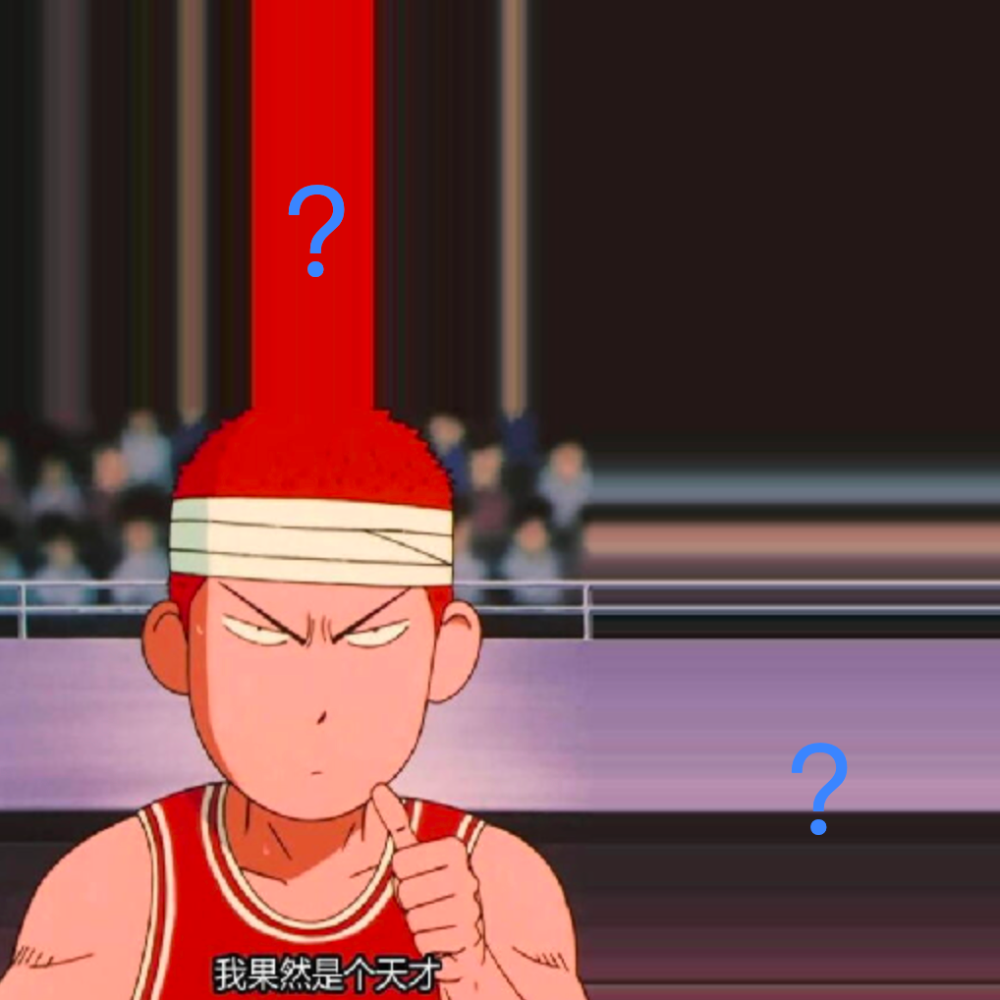

# 6. 深入纹理细节之WRAP

经过上一小节的学习，我们探索了 `FILTER` 相关的参数配置，感受到了 `NEAREST` 和 `LINEAR` 的区别，了解了 `MIN_FILTER` 中的金字塔纹理参数配置，亲自感受过不同金字塔纹理的图像效果！那本节，我们接着探索纹理配置中的另外两种参数配置——`WRAP`。

## `WRAP`参数详解

相信看完上一节的内容（并且缩小过示例程序樱木图片）的同学，一定会有一个大大的问号，那就是为什么我家樱木的头上长草了？还是如此烈焰的红色？比如...下面这张截图：



出现这个现象的根源就是我们这一节将要讲到的 `gl.TEXTURE_WRAP_S` 和 `gl.TEXTURE_WRAP_T` 的这两种配置参数了。首先，还是老样子，我们先看文档，也是看 [gl.texParameteri](https://developer.mozilla.org/en-US/docs/Web/API/WebGLRenderingContext/texParameter) 这个就够了，然后我把它的配置和默认值贴回来方便大家查阅：

| 参数              | 描述                                         | 参数值                                                                      |
|-------------------|----------------------------------------------|-----------------------------------------------------------------------------|
| gl.TEXTURE_WRAP_S | Wrapping function for texture coordinate `s` | **gl.REPEAT (default value)**,<br>gl.CLAMP_TO_EDGE,<br> gl.MIRRORED_REPEAT. |
| gl.TEXTURE_WRAP_T | Wrapping function for texture coordinate `t` | **gl.REPEAT (default value)**,<br>gl.CLAMP_TO_EDGE,<br> gl.MIRRORED_REPEAT. |

好家伙，就这么点参数（狗头.jpg）？相比 FILTER 岂不是洒洒水啦！根据描述我们可以得知这两个参数就是配置纹理水平、垂直方向是如何填充的（s、t代表的是纹理坐标系统）。我们来看看三个配置参数分别代表什么：
1. `gl.REPEAT` 重复纹理。当渲染的模型在水平、垂直方向超出源纹理图像时将重复纹理。
2. `gl.CLAMP_TO_EDGE` 切割纹理边缘。也是当渲染模型超出源纹理图像时，使用纹理图像的边缘值（也就是樱木头上长柱子了）。
3. `gl.MIRRORED_REPEAT` 镜像重复纹理。这个跟 `gl.REPEAT` 差不多，只是它是镜像的效果。

那么，什么场景会用到 `WRAP` 来配置 `S`、`T` 方向上的填充方式呢？我们来看下图：


如上所示，纹理图像的坐标范围都是 `[0, 1]`，现在我配置了一个超出 `[0, 1]` 范围的渲染坐标 `[0, 1.6]`，那么 `1.6` 自然会超出纹理坐标的 `1.0` 范围，那超出的范围的 `S`、`T` 方向就是需要通过 `WRAP` 去配置填充方式的空间了。

讲述完基础知识，我们接着上手实战一个示例程序，大家可以通过切换示例程序中的配置参数来感受一下每个参数的区别：

:::demo
third/6_1
:::

比如说我把示例程序中 垂直、水平 方向的填充都设置成镜像 `MIRRORED_REPEAT`，再把图像缩到最小就能出现如下效果：


此时出现了 4 个镜面对称的樱木～当然，如果我们把垂直方向（`T`）的填充设置成切割纹理边缘 `CLAMP_TO_EDGE` 那就回到了我们熟悉的头顶擎天柱的樱木了～好吧，其他效果大家自己操作示例程序体验一下吧，我就不一一演示、截图了。

在本小节的最后，我们再过一遍示例程序中的核心配置代码：

```js
// FLTER 都设置成了 LINEAR（注意，如果不设置 TEXTURE_MIN_FILTER 就需要提供 MIPMAP）
gl.texParameteri(gl.TEXTURE_2D, gl.TEXTURE_MIN_FILTER, gl.LINEAR)
gl.texParameteri(gl.TEXTURE_2D, gl.TEXTURE_MAG_FILTER, gl.LINEAR)
// WRAP 配置值都是动态根据表单空间的值来变化的
gl.texParameteri(gl.TEXTURE_2D, gl.TEXTURE_WRAP_S, gl[wrapSType.value])
gl.texParameteri(gl.TEXTURE_2D, gl.TEXTURE_WRAP_T, gl[wrapTType.value])
```

### 使用`REPEAT`模式的注意点

相信大家也发现了，在上面的示例程序中我还保留了上一节中使用过的"是否使用 `2` 整数次幂的源图片"这个操作项，既然留下来了，那肯定是有意而为之。 如果已经有同学自己操作过并发现了异常（黑屏），那么恭喜你，你已经 get 到了我保留这个操作项的用意了。

我们正常的切换示例程序中的各种参数来查看图像效果是没有问题的，但如果**关闭了"是否使用 `2` 整数次幂的源图片"这个开关**并且**将 `WRAP` 的配置参数切换到 `REPEAT` 模式**的时候，`canvas` 就黑了！大家可以返回上去操作一下：


如上图所示，只要我们**不用 `2` 整数次幂的源图片**，不管设置 `TEXTURE_WRAP_S` 还是 `TEXTURE_WRAP_T`，只要选择的参数配置跟 `REPEAT` （包括`MIRRORED_REPEAT`）相关显示都会出现异常（黑屏）。

所以这一点跟我们上节所提到的 **`MIPMAP` 的注意事项的其中一点是一样的**，那就是**使用的源图片的尺寸需要是 `2` 的整数次幂**。宽高之间可以不相等，但是各自尺寸的值都得是 `1`、`2`、`4`、`8`、`16`、`32`...
