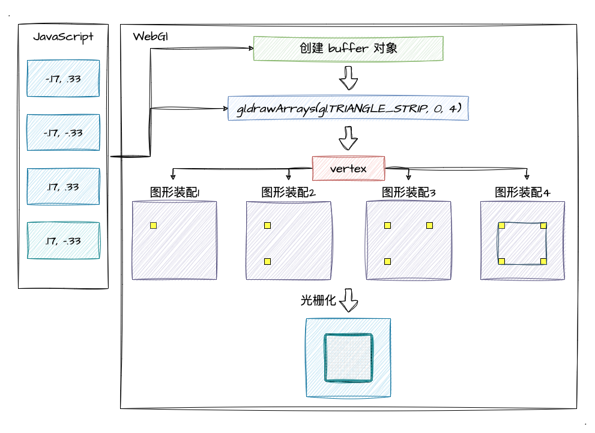

# 2. 为什么出现渐变效果？

经过上一小节的学习，我们掌握了同时给顶点着色器传入多种类型的顶点数据以实现了彩色三角形的绘制。那么，相信代码实现大家是都没问题了，不过不知道大家是否会有个疑问？

为什么我们给三个顶点各传入一个颜色值，却出现了一个**渐变色的三角形**？

## 图形装配和光栅化

对于图形装配和光栅化可能在之前的章节中并没有太多提及，但其实我在第二章第2节讲绘制点的时候有画过这么一张图：

虽然我们之前的内容主要都是集中在顶点着色器和片元着色器之间，中间图形装配和光栅化并没有怎么提及，但其实他们之间是有这么两个步骤的。

为了让大家理解这两个步骤存在的意义，我举一个具体的案例。比如我们现在需要画一个 `100px * 100px` 的纯色正方形，我们需要提供 4 个顶点坐标，并通过 `gl.TRIANGLE_STRIP` 的绘制 mode 就可以绘制出来了。所以，我们先通过一张图来讲坐标确定下来（坐标点不是特别精确，大概画出 100 * 100 的效果）：

那么根据这 4 个坐标点，我们画出一个纯黄色的正方形看看效果：

:::demo
third/2_1
:::

ok，我们提供了4个顶点坐标，并将 `gl_FragColor` 设置成黄色，就可以绘制出一个**黄色的正方形**！那就是说，我们的片元着色器将 4 个坐标点**区间范围内的全部像素点都绘制成黄色**了。这里，我们不难想象到，绘制一个 `100px * 100px` 的纯色正方形，需要对区间内的每个像素点进行着色！

基于这一点，图形装配和光栅化的步骤存在的意义就很明显了。他们需要将顶点坐标**装配成几何图形**，再将装配好的几何图形**转化成一个一个真实的像素**，再给到片元着色器对其进行逐片元操作（对每个像素着色）！所以说，绘制一个 `100 * 100` 的正方形，片元着色器需要执行 `10000` 次！

那我们就以这个案例作为我们的分析对象，看看顶点着色器、片元着色器具体是怎么工作的！
1. 首先，我们通过 `gl.drawArrays(gl.TRIANGLE_STRIP, 0, 4)` 进行图形的绘制。这里的 `count` 参数为 `4`，那就意味着顶点着色器将会执行 `4` 次
2. 执行第一个顶点着色器，第一个坐标点的数据 `(-.17, .33)` 分配给到 `attribute` 变量 —— `a_Position`。然后这个变量会赋值给到 WebGl 内置变量 —— `gl_Position`，然后进入了图形装配阶段，数据被缓存起来了
3. 执行第二个顶点着色器，同样流程，`(-.17, -.33)` 坐标数据被缓存在图形装配阶段。（这里注意，我们的坐标是 `vec4` 类型，我们没传后两位，所以它们使用的是默认值，整个 `gl_Position` 其实是 `(x, y, 0.0, 1.0)`）
4. 执行第三、第四个顶点着色器，同样流程，`(.17, .33,)` 、`(.17, -.33)` 传入并缓存在图形装配区
5. 开始**图形装配**。执行完 `4` 次顶点着色器，开始根据**传入的顶点坐标** 和 **`mode`本例是(`gl.TRIANGLE_STRIP`)** 进行图元装配过程。因此这里会装配出一个 **正方形** 
6. 最后一步是**光栅化**。光栅化的作用是将我们装配好的图形转化成片元（像素）来显示在显示器上，因此光栅化步骤后我们就得到了组成整个正方形的片元（像素）

以下，我画了个图来表示整个图形装配到光栅化的过程：

上图中可以看到，光栅化后我们得到了一个由 `10000`个 像素点组成的 `100px * 100px` 的正方形。最后只需要再通过片元着色器进行一个"逐片元"操作，就会出现我们示例程序中的黄色正方形了！

这里我们应该能想到，我们 `gl.drawArrays` 传入不同的 `mode` 和 `count`，图形装配的结果是不一样的。就比如我们传的 `mode` 不是 `TRIANGLE`类 而是 `LINE`类型的，那装配出来的图形就是一个空心的图形，中间并不会填满像素点。

## 执行片元着色器

上一小节的图形装配、光栅化流程后，就到调用片元着色器进行"逐片元"操作了！在本文的案例中，片元着色器会被调用 `10000` 次！

其实对于每一个片元，片元着色器都会计算出它的颜色值，然后将结果写到颜色缓冲区中。（这个颜色缓冲区就是绘制结果，最终呈现到屏幕当中的，或者我们可以回忆以下清除背景色的时候，不正是清除掉颜色缓冲区吗？）

那在这个案例中，因为是个纯色（黄）的正方形，所以每个片元（像素）的颜色都是黄色，如此一来，最后呈现到我们面前的就是一个 `100px * 100px` 的黄色正方形！