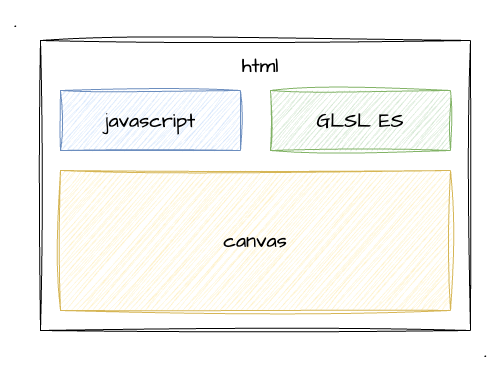

# 1. 初识 WebGl

## WebGl 程序要素

首次接触 WebGl，非常有必要了解 WebGl 程序是怎么运行起来的，它的运行机制将贯穿我们整个 WebGl 的学习之旅。

WebGl 程序运行三要素：
1. HTML5标签 —— `canvas`（超文本标记语言）
2. `JavaScript`（脚本语言）
3. `GLSL ES`（着色器语言）



也就是说，只要具备这三要素，我们就能愉快地在浏览器上实现各种**三维图形**的网页了。

> 当然，刚开始了解到 `GLSL` 这门语言的我们一定倍感陌生，不必紧张，通过逐步深入地学习，我们会慢慢地熟悉它。目前我们简单地将其理解成一门类似 C 的 "画图语言"即可。

## canvas

相信 `<canvas>` 这个标签大家一定不会陌生，WebGl 正是基于它来绘制 3D 图形的！

我认为最简单理解 `canvas` 的方式就是它的直译——**画布**。它就好比一张白纸，允许我们通过 JavaScript 这支画笔在上面动态的绘制图形。

多说无益，我们直接实战画图来贴切地了解它吧：

:::demo 
basic/1_1
:::

如上示例程序，我们通过简单的几行代码便在 `canvas` 中绘制了一个蓝色的正方形和圆形。总结几点：
1. 设置 `canvas` 的 `width` 、 `height` 属性**指定绘制的像素区域**
2. 获取 `canvas` 绘图环境：`getContext('2d')`
3. 设置颜色值 `RGBA`；设置绘图坐标、尺寸

ok，这就是简单的 `canvas` 绘制 2d 图形的程序（本文将默认你有一定的 `canvas` 基础，不会对其详细展开）。到此，我们可以留意一下 `getContext('2d')` 、 `RGBA` 和 `坐标` ，因为这几个在 WebGl 绘图中也会用到，但是稍有不同。

## 第一个 WebGl 程序

看到这一节，你已经具备理解一个简单的 WebGl 程序的能力了。

这里，我们不抠细节，直接通过一个实战案例来过一遍 WebGl 程序的所有"执行要素"。当前你无需关注每一行代码实现，只要关注流程即可。

首先回顾一下 WebGl 程序的三要素！
1. `canvas`
   - 获取 `canvas` 元素
   - 获取绘图环境 `getContext('webgl')`
```js
// html 标签
<canvas id="ice-canvas"></canvas>

// 获取 canvas 
const canvas = document.querySelector('#ice-canvas')
// 获取 WebGl 的绘图上下文（传入的参数是 webgl）
const gl = canvas.getContext('webgl')
```
2. `JavaScript`
   - 创建顶点着色器
   - 创建片元着色器
   - 创建 `GLSL` 着色程序
```js
// 创建顶点着色器
const vertexShader = createShader(gl, gl.VERTEX_SHADER, vertexCode)
// 创建片元着色器
const fragmentShader = createShader(gl, gl.FRAGMENT_SHADER, fragmentCode)
// 创建 GLSL 着色程序
createProgram(gl, vertexShader, fragmentShader)
```
3. `GLSL ES`
   - 顶点着色器函数
   - 片元着色器函数
```js
const vertexCode = `
  void main () {
    // 顶点坐标
    gl_Position = vec4(0.0, 0.0, 0.0, 1.0);
    // 顶点渲染像素大小
    gl_PointSize = 24.0;
  }
`
const fragmentCode = `
  void main () {
    // 顶点颜色——蓝色
    gl_FragColor = vec4(0.0, 0.0, 0.9, 1.0);
  }
`
```

接下来通过一张图来加深我们对整个执行阶段的理解：


了解了一个基本的 WebGl 程序要素后，我们通过一个实战代码来看到实现的效果（如下示例程序）。
:::demo
basic/1_2
:::

当你点开示例程序源码的时候，你会发现实现一个小小的像素点就需要大量的代码！这是因为 WebGl 是**比较底层**的，它甚至没有像 `canvas 2d` 那样有一些成型的 `api` 来调用，所以很多地方都需要自己实现。这也其是劝退了很多初学者的其中一个点吧！但我认为，只要肯静心下来，肯定是可以学会的。

初步接触了 WebGl 的程序了，我们用它来绘制了一个二维的像素点。

在接下来的学习过程中，我会将一些比较基础的实现进行封装，比如示例程序中的 `createShader`、`createProgram` 这种常用的函数。
