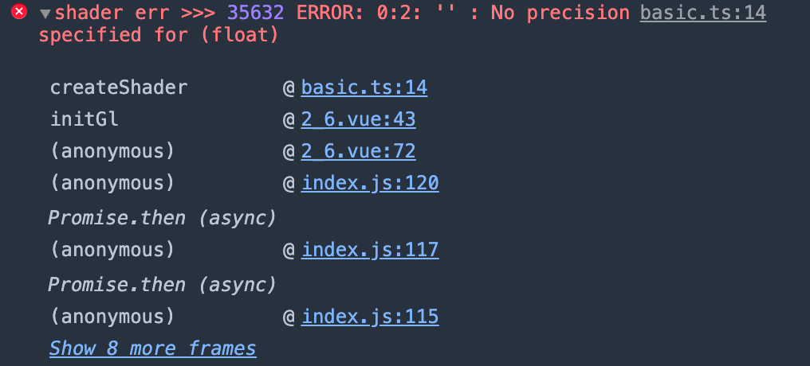

# 4. 绘制动态颜色点

经过上一小节的学习，我们已经掌握了通过 `attribute` 变量传递动态值给**顶点着色器**实现动态点的绘制。但其实我们的点都只有蓝色这一种颜色，那么这一节，我们来实现动态改变点的颜色！

## `uniform` 变量

上节讲到 `attribute` 变量时有提到一下 `uniform` 变量，不过没有展开讲。我们上节讲到 `attribute` 变量时，特别提了它**只能在顶点着色器**中使用，而我们要实现动态颜色绘制的话，我们得对 **片元着色器** 下手，于是乎我们就找来了 `uniform`。

`uniform` 变量可以在顶点着色器和片元着色器中被访问，而我们用其来声明变量的方式跟 `attribute` 是一样的，比如：
```glsl
// 存储限定符 类型 变量名
uniform vec4 u_FragCOlor
```

在着色器中声明变量后，我们就可以改造一下片元着色器的代码了，那首先我们回顾一下之前的代码：
```js
const fragmentCode = `
  void main () {
    // 顶点颜色——蓝色 (R, G, Bule, A)
    gl_FragColor = vec4(0.0, 0.0, 0.9, 1.0);
  }
`
```

可以看到，我们给内置变量 `gl_FragColor` 赋值了一个固定的 `vec4` 类型的颜色值，那么我们现在使用 `uniform` 对其进行改造：
```js
const fragmentCode = `
  precision mediump float;
  uniform vec4 u_FragColor;
  
  void main () {
    gl_FragColor = u_FragColor;
  }
`
```

**注意一点**！上面代码中使用 `precision mediump float;` **精度限定词**来指定变量的范围和精度。不加的话，在创建片元着色器的时候会出现如下错误：



其实就是告诉我们**未为指定浮点精度**。所以新手上路自己敲代码的时候得注意一下这点。

接下来，我们跟 `attribute` 变量赋值一样，先通过 api 获取变量的存储位置，再给其设值就可以了。整体是非常相似的，只是 api 有点区别：

| api                                                                                                                | 参数值                                          | 参数值说明                                                                           | 返回值             |
|--------------------------------------------------------------------------------------------------------------------|-------------------------------------------------|--------------------------------------------------------------------------------------|--------------------|
| [gl.getUniformLocation](https://developer.mozilla.org/en-US/docs/Web/API/WebGLRenderingContext/getUniformLocation) | (program, name)                                 | 1. program：<br> WebGl program 对象<br>2. name：<br>获取的变量名                     | 属性位置的下标数字 |
| [gl.uniform[1234]f[v]](https://developer.mozilla.org/en-US/docs/Web/API/WebGLRenderingContext/uniform)             | (index, v0, v1, v2, v3) <br>以 `uniform4f` 为例 | 1. index：<br>attribute 变量的存储位置<br>2. `v0`-`v3`：<br>代表 rgba 每位值的浮点数 | -                  |

我们根据 `attribute` 变量的用法方式，可以将上一节的 示例程序 进行一个小的改造：
```js
// 获取 unfirom 变量存储位置
const u_FragColor = gl.getUniformLocation(program, 'u_FragColor')
// 通过 随机数 对 rgb 进行赋值，透明度固定为 0.8
gl.uniform4f(u_FragColor, Math.random(), Math.random(), Math.random(), .8)
```

通过以上几行代码的改造，我们再来看看这个示例程序的运行效果：

:::demo
basic/2_6
:::