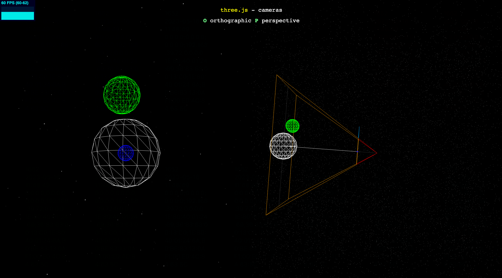
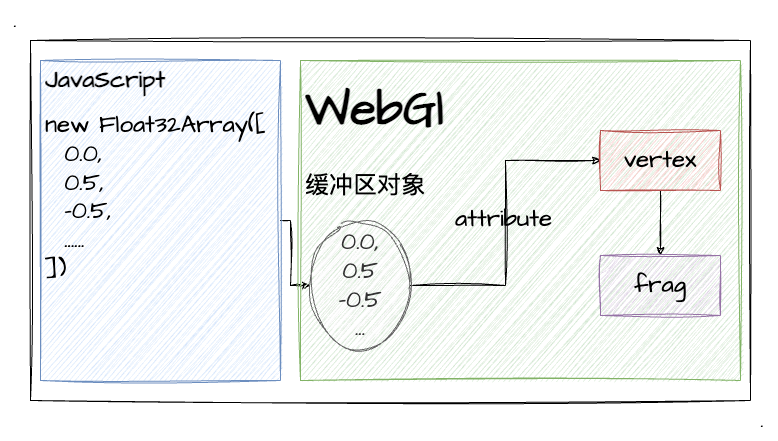

# 5. WebGl绘制线和三角

经过前面几个小节的学习，我们已经学习了点的绘制；一些相关的 GLSL 语法、内置变量和写法，那么从这一节开始，我们将继续深入了解**缓冲区对象**，通过 WebGl 来绘制线和面。

虽说是用 WebGl 绘制线和面，但其实大家应该早就知道了 3D 图形的基本单位是三角形，也就是三角形是所有面、3D 图形的基础。我们可以直接在 [three.js](https://threejs.org/examples/#webgl_camera) 的这个 demo，很显然立体图形是通过拼合多个三角形构成的，所以说**三角形是 3D 图形的基础**。

## 缓冲区对象

我们想一想，缓冲区对象是什么？为什么需要缓冲区对象？

回顾之前我们绘制点的做法，我们都是通过 `gl.drawArrays()` 来实现单个点的绘制，而且当时我们还简单介绍了一下这个 api 的用法（[第2小节](/content/二、WebGl基础/2.%20WebGl绘制点.html)）。我们在这里简单回顾一下：

| api       | 参数值 | 参数值说明 | 返回值                              |
|--------------|------|-----------------------------------|--|
| [gl.drawArrays](https://developer.mozilla.org/en-US/docs/Web/API/WebGLRenderingContext/drawArrays) | (mode, first, count) | 1. mode： `gl.POINTS` 绘制单个点 2. first： 指定开始绘制的点 3. count： 指定绘制多少个点 | - |

可以看到参数值说明，我们之前只了解了其中一个 mode 值——`gl.POINTS`。那其实 mode 还有其他的参数值，比如：
- `gl.LINE_STRIP`
- `gl.LINE_LOOP`
- `gl.TRIANGLES`

等等...我们通过它的英文名称不难发现 points 、line 、triangles 不就是 点、线、三角形吗？没错，其实我们改变 `gl.drawArrays` 这个 api 的 mode 的参数值，WebGl 就帮我们绘制对应的图形。

那么问题来了，之前我们绘制一个点的时候只需要传入一个点的坐标位置给到 `gl_Position` 即可，但是我们现在**绘制线和三角形**，最少一次调用 `gl.drawArrays` 之前都得设置两个以上的顶点坐标值对吧？所以，这个时候我们就需要**缓冲区对象**了。

缓冲区对象可以**一次性传入多个顶点数据**（包括但不限于坐标数据，还可以有颜色和其他的），保存在缓冲区中，后续顶点着色器、片元着色器就可以使用里面的数据。

我们通过下图来大概了解缓冲区的应用过程：
1. js 中定义了 `Float32Array` 类型的数组（我们可以简单理解为普通 js 数组）
2. 将 js 数组传递并存储于缓冲区对象中
3. `gl.drawArrays()` 绘制时，顶点、片元着色器可以通过缓冲区读取多个顶点数据

图画得比较简单，一时没看懂没关系，我们接着往下走，当你使用缓冲区成功绘制出线、三角形的时候再回来看这个图会有更深的理解。

## 使用WebGl缓冲区

缓冲区的使用遵循一个步骤，其中也会涉及到一些新的 api ，我们一步一步来看：
1. 通过 `gl.createBuffer` 创建缓冲区对象
2. 通过 `gl.bindBuffer` 绑定缓冲区对象（因为无法直接操作缓冲区对象，需要绑定到一个 target 上，然后我们去操作 target）
3. 通过 `gl.bufferData` 写入缓冲区数据，如上图中的 `Float32Array` 数据
4. 通过 `gl.vertexAttribPointer` 将缓冲区数据分配到 `attribute` 变量
5. 通过 `gl.enableVertexAttribArray` 开启 `attribute` 变量

好像是稍微有那么一点复杂，涉及各种 api 的使用和参数传递，但是其实我们可以在学习之后自行将其进行一定的封装，沉淀为一个工具函数。处于学习阶段的我们需要掌握它，所以还是有必要了解每一个步骤。那接下来，我们一步一步的来展开说说吧！

:::demo
basic/5_1
:::
