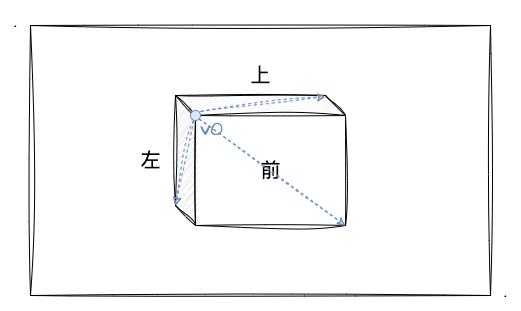

# 2. 深入立方体的绘制

上一小节中，我们实战了一个渐变色立方体的绘制，学习了新的绘制`api`，但是在文章的结尾，我留下了个疑问，就是如何绘制一个6面为不同纯色的立方体呢？那我们这一节将继续探讨关于立方体的绘制！

## 构造立方体数据

那么，上一节的文末我简单分析了一下仅用 `8` 个顶点来绘制立方体无法实现六面为不同纯色立方体的原因。那这里，我们配合图片来加深一下理解：



如图所示，如果仅使用 `8` 个点来绘制立方体的时候，蓝色顶点 `v0` 将被 **前、上、左** 三个面**共享**。也就是说只要当前面的**其他顶点颜色**跟 `v0` 的不同，那一定会被 WebGL 的内插行为致使那个面产生一个颜色渐变的效果。

所以基于以上的分析，我们如果要实现六面为**不同纯色**的立方体，那就不能出现**公共点**。也就是说我们不能出现一个点被多个面公用的情况！因此我们就需要将立方体的每个面**分别绘制**，那么一个面至少得用 `4` 个点来表示，六个面总共需要 `24` 个点～

现在我们来看看上一小节渐变立方体的顶点、颜色和索引值的数据：

```js
// 顶点坐标
const vertices = new Float32Array([
  -.5, .5, .5, // v0
  -.5, -.5, .5, // v1
  .5, -.5, .5, // v2
  .5, .5, .5, // v3
  .5, .5, -.5, // v4
  .5, -.5, -.5, // v5
  -.5, -.5, -.5, // v6
  -.5, .5, -.5,  // v7
])
// 颜色值
const colors = new Float32Array([
  1., 1., 1., 1.,
  1., 1., 0., 1.,
  1., 1., 1., 1.,
  1., 0., 1., 1.,
  0., 1., 1., 1.,
  0., 0., 1., 1.,
  1., 1., 0., 1.,
  0., 1., 1., 1.,
])
// 索引值
indices = new Uint8Array([
  0, 1, 2, 0, 2, 3, // 前
  3, 2, 5, 3, 5, 4, // 右
  4, 5, 6, 4, 6, 7, // 后
  7, 0, 6, 0, 1, 6, // 左
  0, 3, 4, 0, 4, 7, // 上
  1, 2, 5, 1, 5, 6 // 下
])
```

其实列了一大堆数字，我并不是要大家去看这一个个数字，而是需要大家能一一对应得上每**行**数据之间的关系。我们重点看 `vertices` 顶点坐标数组 和 `indices` 索引数组。这里 `vertices` 总共有 `8` 个顶点坐标数据，并且在 `indices` 索引数组中，通过 `0-7` 的索引一一对应上了每个顶点坐标。

大家可能也注意到 `indices` 索引数组中**每行数据**后都有注释表明这一堆索引是组合立方体的哪一个面的。那基于前文的构造六面不同纯色立方体的顶点个数分析，如果我们要用 `24` 个顶点坐标来绘制立方体，显然上述的 `vertices` 顶点坐标数组的**坐标个数是不够的**～
