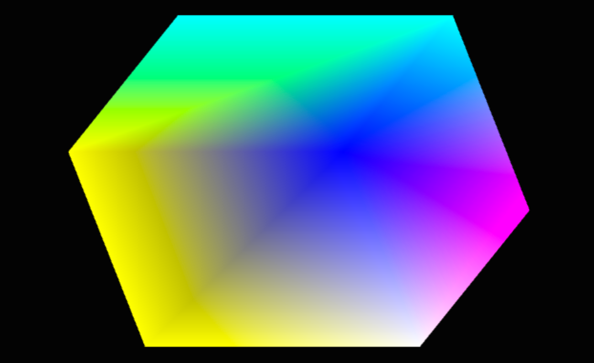

# 3. 奇妙的相机

从上两个小节我们已经掌握了立方体的绘制方式，并且我们可以通过一定的手段（旋转）来观察出我们绘制的是一个立方体而不是普通的矩形。那么在这其中，涉及到了一些 3D 绘制中的概念知识，我们这一节就来学习一下吧！

## 什么是相机？

也许有同学跟我一样，其实没用过 `three.js`，并且也不熟悉这个框架，但是对于其中的一个概念——**相机**，却是早有耳闻。不过即使你曾经不懂得这个概念也没关系，这一小节跟着我的步伐，我们一起来探索一下什么是相机。

还有小伙伴记得如下截图吗？这是第一节绘制渐变立方体时候的示例截图。


没错，仅从这个截图来看，你绝对不可能知道这是一个立方体的示例程序。从这个图中我们可以深刻地体会到，3D 图形虽然跟 2D 图形相比它多了一个**深度**，也就是 `Z` 轴，但是**其最终还是会被绘制到我们的二维屏幕**中。

因为出现了上述的问题，于是乎我就通过一定的手段（比如说旋转），使立方体以"不同地角度"呈现在我们面前。这样一来，我们就可以发现它是一个立方体图形了（如下图所示）。



没错，我们作为观察者，可以通过**不同的角度、距离**去观察我们的立方体图形，也就是一个**相机**的概念了。相机代表着我们观察一个 3D 图形的观察点，比如说我们是以什么样的角度观看目标的？我们是在多远的位置观看目标的？

所以我觉得，用相机来描述 3D 图形的**观察者视觉**是非常形象、生动的。好比我们平时生活中，从不同的角度、距离去拍摄一些 3D 的物体，都会得到不太一样的照片效果～现实中负责拍照物体的我们，完全可以类比成在 3D 图形世界中的观察者，也就是相机了！

## 视图矩阵

上一小节中我们了解了相机的概念，那这一小节开始，我们深入研究下如何描述相机的观察方向，或者说我们观察一个物体，需要具备什么样的条件。这里我们引入三个概念：
1. **视点**。观察点，也可以理解为三位坐标中的相机位置，是**视线的起点**。
2. 观察**目标点**。被观察的目标点，视线将穿过目标点且继续延伸。
3. **上方向**。图形绘制到屏幕时向上的方向，将配合视点、目标点固定图形的显示方位。


他们之间的关系如上图所示。那么**视点**和**目标点**在理解层面应该是没什么异议的，但是对于**上方向**可能会有同学不解。对于上方向的理解，我再画一张图出来大家就好理解了：


如上图所示，即使我们明确了**视点**和**目标点**，并且能连线出**视线**，但我们正着看、转着看、还是倒着看呢？所以，仅仅确定了视点和目标点，仅能敲定出视线，具体的观察角度，还需要有**上方向**来帮我们确认。

一句话总结就是：要确定最终图形绘制到屏幕上的样子，**视点、目标点、上方向三者缺一不可**。

在了解完相机的观察方向相关概念后，我们应该如何把相机的概念跟我们的代码结合起来呢？答案就是本小节的主题——**视图矩阵**。视图矩阵可以用来表示相机在场景中的状态，有视点、观察目标、上方向，换句话说，视图矩阵要确定最终图形绘制到屏幕上的样子。

在介绍视图矩阵长什么样之前，我还想带着大家先回忆一下之前的平移矩阵、旋转矩阵等矩阵是怎么来的。回顾之前，我们是通过将数学公式（平移、旋转等）代入矩阵乘矢量的算式中，逐步推导出来。然后在后续的实战中，我们仅借助**矩阵的库**（three.js的）来帮我们创建矩阵，简化了非常多的东西。好了，说了这么多就想告诉大家一个核心点！不要慌！不难！！！

回到主题，视图矩阵其实就是通过那三个概念组合起来的，有视点、观察目标点、上方向，我们知识把概念转换成坐标点，放到矩阵中便是视图矩阵了。比如现在我们用 `cX` 代表视点坐标（camera）、`tX`代表目标点（target）、`uX`代表上方向（up）来表述我们的视图矩阵：

```js
[
  cX, cY, cZ,
  tX, tY, tZ,
  uX, uY, uZ,
]
```

光看这个矩阵可能比较抽象，所以我将一个实际场景来代入到其中。当我们处于 WebGL 坐标系的**初始观察位置**时，三者的实际坐标如下：
1. 视点应该位于坐标原点，也就是这个时候 `cX、cY、cZ` 都应该是 `0`。
2. 视线是朝着屏幕向内，所以观察目标点 `tX、tY、tZ` 应该是 `(0, 0, -1)`。
3. 上方向应该是 Y 轴方向，也就是 `uX、uY、uZ` 应该是 `(0, 1, 0)`。

总结：默认的视图矩阵应为：

```js
[
  0, 0, 0,
  0, 0, -1,
  0, 1, 0,
]
```

对应的坐标系关系如下图（绿色代表相机，正对屏幕朝内）：


## 用相机观察图形

在学习完相机的基础概念、视图矩阵后，紧接着进入实战环节。这次，我们通过**视图矩阵**来观察绘制在 WebGL 中的图形。当然，在实战开始前当然还是去看看 `three.js` 的 `Matrix4` 这个库有没有提供视图矩阵的相关 `api`！

:::demo
fifth/3_1
:::