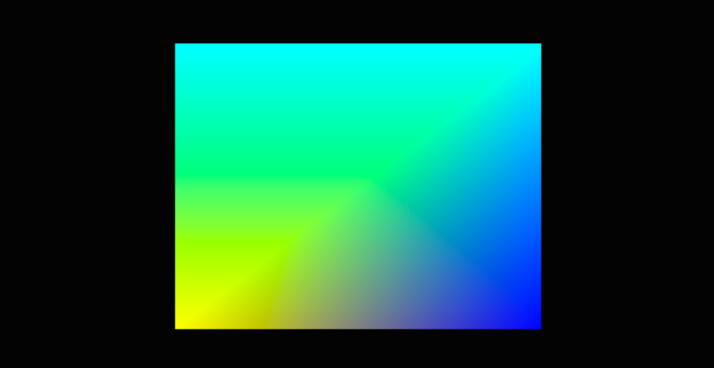

# 3. 奇妙的相机

从上两个小节我们已经掌握了立方体的绘制方式，并且我们可以通过一定的手段（旋转）来观察出我们绘制的是一个立方体而不是普通的矩形。那么在这其中，涉及到了一些 3D 绘制中的概念知识，我们这一节就来学习一下吧！

## 什么是相机？

也许有同学跟我一样，其实没用过 `three.js`，并且也不熟悉这个框架，但是对于其中的一个概念——**相机**，却是早有耳闻。不过即使你曾经不懂得这个概念也没关系，这一小节跟着我的步伐，我们一起来探索一下什么是相机。

还有小伙伴记得如下截图吗？这是第一节绘制渐变立方体时候的示例截图。

没错，仅从这个截图来看，你绝对不可能知道这是一个立方体的示例程序。从这个图中我们可以深刻地体会到，3D 图形虽然跟 2D 图形相比它多了一个**深度**，也就是 `Z` 轴，但是**其最终还是会被绘制到我们的二维屏幕**中。

因为出现了上述的问题，于是乎我就通过一定的手段（比如说旋转），使立方体以"不同地角度"呈现在我们面前。这样一来，我们就可以发现它是一个立方体图形了（如下图所示）。

没错，我们作为观察者，可以通过**不同的角度、距离**去观察我们的立方体图形，也就是一个**相机**的概念了。相机代表着我们观察一个 3D 图形的观察点，比如说我们是以什么样的角度观看目标的？我们是在多远的位置观看目标的？

所以我觉得，用相机来描述 3D 图形的**观察者视觉**是非常形象、生动的。好比我们平时生活中，从不同的角度、距离去拍摄一些 3D 的物体，都会得到不太一样的照片效果～现实中负责拍照物体的我们，完全可以类比成在 3D 图形世界中的观察者，也就是相机了！

## 视图矩阵

上一小节中我们了解了相机的概念，那这一小节开始，我们深入研究下如何描述相机的观察方向，或者说我们观察一个物体，需要具备什么样的条件。这里我们引入三个概念：
1. 视点
2. 观察目标点
3. 上方向