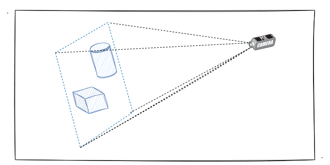

# 4. 进阶——推导视图矩阵

上一节我们初步了解了相机和视图矩阵，并且通过 `three.js` 的 `lookAt` 方法实战感受了通过相机观测图形的效果，get 到了变换相机位置观测图形和变换图形自身是一个反方向但变换是等价的效果。那么这一节，我跟大家一起来推导一下视图矩阵，以加深对相机这个概念的理解！

## 深入视图矩阵

视图矩阵在上一节内容中简单地了解了，并通过旋转相机实现了 3D 场景中的图形做**等价的逆变换**的效果，比如说上一节中的实战示例程序中的立方体是向相机的反方向旋转的。

上一节讲视图矩阵的时候也有提到平移、旋转矩阵，并且我们可以把平移、旋转等变换通过矩阵相乘的方式以**模型矩阵**的方式去承载，也就是用模型矩阵来表示复合变换。这个时候又冒出个视图矩阵不禁让人有点难以理解，所以我想在这里讲清楚一点各种矩阵之间的关系。

平移、旋转、模型矩阵等都是**作用于场景中的物体**（也就是观测目标），而视图矩阵是**作用于相机**。比如你在场景中有一个车库，你需要拍几张照片来对外宣传。为了装X，你把比较贵的车开到了最外面（相当于对场景中的物体做了变换操作）；为了拍出来的效果够震撼，你又特地站到了车库的45度位置进行拍摄（相当于给相机做了变换），最后拍出一张牛逼的照片。

比如下图，我用相机水平方向拍摄一个圆柱和一个正方体：

现在我要**相机跟场景中的物体**一起做绕 `Z` 轴做小幅度的逆时针旋转：

结合两图的表象，我们可以总结出这么一个结论：**当场景、相机同时运动时，相机拍出来的图片时一模一样的**。得出这个结论有什么用？试想一下，如果一个变换矩阵（视图矩阵）可以使相机落在坐标系原点，且相机的上方向就是 `Y` 轴，面向 `Z` 轴的负半轴（右手坐标系）；同理，我们**把场景也乘上这个视图矩阵，那就可以保持相机中的画面不变了**。

简单总结：其实视图矩阵的作用就是把世界坐标系跟相机坐标系做一个转换，把世界坐标系场景放到相机里。

当然 WebGL 中的矩阵并不仅仅有上述的模型矩阵、视图矩阵，还有后续我们要学到的投影矩阵，他们统称为 MVP 矩阵。

## 推导视图矩阵

根据前文的讲述我们知道：通过视图矩阵变换要使我们的相机坐落在坐标系的原点。因此，我们就要基于这一点来进行视图矩阵的推导。结合上一节学习的内容，我们可以知道相机会有 视点、观察目标点、上方向 三种数据信息，于是我们可以通过**对这些相机信息的坐标原点还原**来推导出我们的视图矩阵。

将相机通过视图矩阵变换到坐标原点可以从这三个方面入手：
1. 通过**平移**相机视点，将相机**平移到坐标轴原点**
2. 通过**旋转**将相机的**上方向调整为与 `Y` 轴重合**
3. 通过**旋转**将相机的**视线朝向 `Z` 轴的负方向**（右手坐标系）

通过上述的变换操作，下图将会是相机最终的变换结果：

根据我们已学过的知识，上述几点变换的最终结果无非就是对相机进行了 **平移矩阵 x 旋转矩阵** 的复合变换。并且通过上图我们可以清晰地看出来，其实相机也有自己的一个坐标系，跟世界坐标系最大的区别就是`Z`轴是朝屏幕内了。

于是，我们可以理解为我们现在就是要把场景从世界坐标系放入相机坐标系中。也就是说，**图形经过视图矩阵的变换后，等价于是把原本的场景（世界坐标系）放到了我们的相机中**，这也是最终的图像绘制成像效果的决定因素。这句话现在理解起来可能比较困扰，不懂的也不用深究，接着往后学就行。

首先我们从易到难，先从简单的**平移**入手。回顾之前我们推导出来的平移矩阵：

现在我们假设**视点坐标**为 `(cX, cY, cZ)`，如果我们要把这个坐标移动到原点 `(0, 0, 0)`，那直接跟自身坐标相减即可，也就是 `(-cX, -cY, -cZ)`。所以我们直接把后者代入平移矩阵即可：

将相机平移到原点后，紧接着我们要把**视点到观察点的视线方向**变换为指向 `Z` 轴的负半轴 `(0, 0, -1)` 位置；并且还要把**上方向转动到跟 `Y` 轴重合**，也就是坐标 `(0, 1, 0)`。

:::demo
fifth/3_2
:::