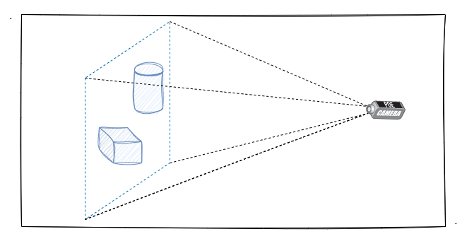

# 4. 进阶——推导视图矩阵

上一节我们初步了解了相机和视图矩阵，并且通过 `three.js` 的 `lookAt` 方法实战感受了通过相机观测图形的效果，get 到了变换相机位置观测图形和变换图形自身是一个反方向但变换是等价的效果。那么这一节，我跟大家一起来推导一下视图矩阵，以加深对相机这个概念的理解！

## 深入视图矩阵

视图矩阵在上一节内容中简单地了解了，并通过旋转相机实现了 3D 场景中的图形做**等价的逆变换**的效果，比如说上一节中的实战示例程序中的立方体是向相机的反方向旋转的。

上一节讲视图矩阵的时候也有提到平移、旋转矩阵，并且我们可以把平移、旋转等变换通过矩阵相乘的方式以**模型矩阵**的方式去承载，也就是用模型矩阵来表示复合变换。这个时候又冒出个视图矩阵不禁让人有点难以理解，所以我想在这里讲清楚一点各种矩阵之间的关系。

平移、旋转、模型矩阵等都是**作用于场景中的物体**（也就是观测目标），而视图矩阵是**作用于相机**。比如你在场景中有一个车库，你需要拍几张照片来对外宣传。为了装X，你把比较贵的车开到了最外面（相当于对场景中的物体做了变换操作）；为了拍出来的效果够震撼，你又特地站到了车库的45度位置进行拍摄（相当于给相机做了变换），最后拍出一张牛逼的照片。

比如下图，我用相机水平方向拍摄一个圆柱和一个正方体：

现在我要**相机跟场景中的物体**一起做绕 `Z` 轴做小幅度的逆时针旋转：

结合两图的表象，我们可以总结出这么一个结论：**当场景、相机同时运动时，相机拍出来的图片时一模一样的**。得出这个结论有什么用？试想一下，如果一个变换矩阵（视图矩阵）可以使相机落在坐标系原点，且相机的上方向就是 `Y` 轴，面向 `Z` 轴的负半轴（右手坐标系）；同理，我们**把场景也乘上这个视图矩阵，那就可以保持相机中的画面不变了**。

那么这里我们暂且可以不用深究为什么要把相机还原到坐标原点，我们先记住就行了，后续讲到投影相关的知识点时可以再回来回顾一下。

## 推导视图矩阵

根据前文的讲述我们知道：通过视图矩阵变换要使我们的相机坐落在坐标系的原点。因此，我们就要基于这一点来进行视图矩阵的推导。结合上一节学习的内容，我们可以知道相机会有 视点、观察目标点、上方向 三种数据信息，于是我们可以通过**对这些相机信息的坐标原点还原**来推导出我们的视图矩阵。

:::demo
fifth/3_2
:::