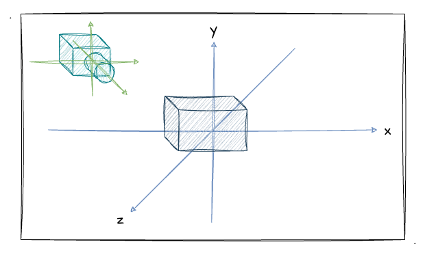
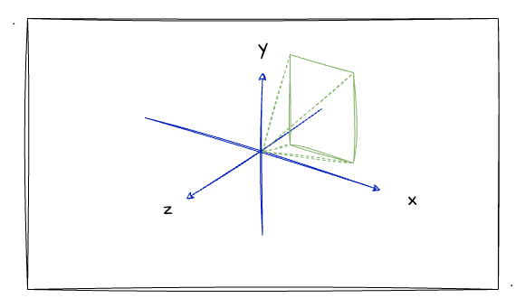
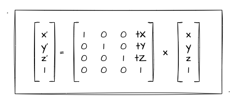
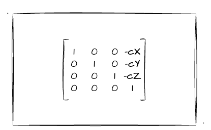
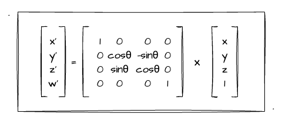
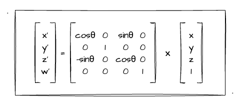

# 4. 进阶——推导视图矩阵

上一节我们初步了解了相机和视图矩阵，并且通过 `three.js` 的 `lookAt` 方法实战感受了通过相机观测图形的效果，get 到了变换相机位置观测图形和变换图形自身是一个反方向但变换是等价的效果。那么这一节，我跟大家一起来推导一下视图矩阵，以加深对相机这个概念的理解！


## 如何理解视图矩阵？

上一节在介绍相机的时候，我实战了一个示例程序，效果是当我们改变相机方向时，立方体是向相机的反方向旋转的。因此我们得出了移动相机观察立方体其实是移动立方体的**等价逆变换**。

相信大家一定知道，相机可以实现观察物体的关键便是**视图矩阵**。但上一节内容中，关于这个矩阵是长什么样，它的意义是什么等疑问都没有深入展开，而是直接套用了 `three.js` 矩阵中的 `lookAt` 方法来实现了相机效果而已。

我们其实可以想象成在世界坐标系中，既有我们的场景，也有一个相机。而这个相机，他有坐标点、视线、和上方向，所以我们可以理解成相机存在于世界坐标系中，并且**它有一个属于自己的坐标系（相机坐标系）**。



如上图所示，相机（绿色坐标轴）位于世界坐标系（蓝色坐标轴）的一个位置观察立方体，并且它也有一个自身的坐标系。而相机的坐标系，完全可以通过我们上一节经常提的 **视点、观察点、上方向** 来求出。

或者我们可以这么理解，当我们没有设置相机时，相机就是默认在世界坐标系的原点、上方向为 `Y` 轴，视线沿着屏幕朝内（`Z`的负半轴）。

既然相机有一个自身的坐标系，这也就意味着当我们把**世界坐标系中的场景放到对应的相机坐标系**中，便是最终绘制在屏幕上图像的最终形态了。而这一变换坐标系的过程，便是依靠 **顶点坐标 左乘 视图矩阵** 的数学算式而实现的。这一点还是比较好理解的，毕竟这跟我们之前学习的**平移矩阵、旋转矩阵**的图形变换，再到后来复合变换所用的**模型矩阵**是一个异曲同工的图形变换。因此，这也再一次说明了矩阵对于 WebGL 真的非常重要。

当然，相机跟场景还有一个特性那就是**当相机、场景同时做等价变换时，相机中所看到的图像都是一样的**。比如下图，我用相机水平方向拍摄一个圆柱和一个正方体：


现在我要**相机跟场景中的物体**一起做绕 `Z` 轴做小幅度的逆时针旋转：


由这两图这可以看出，场景、相机同时进行了旋转变换，相机中拍摄出来的图像是不会变的。

简单总结：其实视图矩阵的作用就是把**世界坐标系跟相机坐标系做一个转换**，把世界坐标系场景放到相机里。 当然 WebGL 中的矩阵并不仅仅有上述的模型矩阵、视图矩阵，还有后续我们要学到的投影矩阵，他们统称为 MVP 矩阵，相信经过后续的学习，我们会逐步揭开图形成像的各种秘密。

## 推导视图矩阵

根据前文的讲述我们知道，视图矩阵会把原本世界中的场景放到相机里。因此，我们就要基于这一点，**推导出基于世界坐标系的相机坐标系**。结合上一节学习的内容，我们可以知道相机会有 视点、观察目标点、上方向 三种数据信息，于是我们可以通过**对这些相机的信息**来推导出我们的视图矩阵。

视图矩阵推导的两个要点：
1. 平移相机。使相机坐标系的原点跟世界坐标系的原点**重合**
2. 旋转相机。在上述基础上，旋转相机坐标系，使其上方向跟世界坐标系的`Y` 轴**重合**，并看向 `Z` 轴的负方向

当经过上述的变换操作后，下图将会是相机最终的变换结果（相机往`Z`轴负方向看去）：



### 1. 平移相机

根据我们已学过的知识，上述几点变换的最终结果无非就是对相机进行了 **平移矩阵 x 旋转矩阵** 的复合变换。并且通过上图我们可以清晰地看出来，其实相机坐标系跟世界坐标系最大的区别就是`Z`轴是朝屏幕内的。

首先我们从**平移**入手。回顾之前我们[推导出来的平移矩阵](/content/四、WebGL二维动画/3.%20用矩阵实战图形变换.html)（矩阵最右边一列）：



现在我们假设**相机坐标**为 `(cX, cY, cZ)`，为了使其跟世界坐标系原点 `(0, 0, 0)` 重合，那直接跟自身坐标相减即可（将相机平移到世界坐标原点），也就是 `(-cX, -cY, -cZ)`。所以我们直接把后者代入平移矩阵即可得到如下矩阵：



将相机平移到原点后，紧接着我们要把**视点到观察点的视线方向**变换为指向 `Z` 轴的负半轴 `(0, 0, -1)` 位置；并且还要把**上方向转动到跟 `Y` 轴重合**，也就是单位向量 `(0, 1, 0)` 的位置。既然要做旋转，那就不可以缺少**旋转矩阵**，正好之前学习图形变换的时候并没有对旋转矩阵进行推导，所以这里我们一起过一遍。

### 2. 推导旋转矩阵

虽然之前没有推导过旋转矩阵，但对于旋转的实现我们还是实践过的。回顾一下转轴公式：


如上图，这是绕 `Z` 轴做旋转的转轴公式。旋转矩阵也可以按照之前推导平移、缩放矩阵一样进行推导。现在我们就以绕 `Z` 轴旋转为例进行推导，还是之前的**矩阵乘矢量**的图如下：


回顾矩阵乘法可知：`x' = ax + by + cz + dw`。再根据绕 `Z` 轴做旋转的转轴公式，我们可以推导出如下等式：

```js
// 齐次坐标中 w 的值为 1
x' = ax + by + cz + dw = ax + by + cz + d = x·cosθ - y·sinθ
```

以此我们可以推算出系数`a`为 `cosθ`，系数`b`为 `-sinθ`，`c`为`0`。又因在齐次坐标中，`w`的值为`1`，所以可以推断出系数`d`也是`0`。以此类推，我们可以得到如下的旋转矩阵：


至于第三行，第四行为什么是`(0,0,1,0)`和`(0,0,0,1)`，我是这么理解的：任何矩阵乘**单位矩阵**都为他本身，而此旋转矩阵是绕`Z`轴旋转所求得的，所以不应该改变它原有的`Z`和`W`值。毕竟齐次坐标的`W`的值一般固定为`1`，而绕`Z`轴旋转，`Z`的值在旋转前后也是恒定不变的...

基于上述的绕`Z`轴旋转矩阵，我就不一一推导其他的了，毕竟方式就这么个方式，大家也可以自己动手推导一下。所以这里我们直接看结果吧，看看基于`X`轴、`Y`轴旋转的旋转矩阵长什么样。首先是绕`X`轴旋转的：



再看看绕`Y`轴旋转的：



于是，我们在推导视图矩阵前，~~重温~~（学习）了旋转矩阵的推导过程，分别看过绕三轴旋转的旋转矩阵各长什么样。那接下来，我们就要基于这三种旋转矩阵的基础，进入旋转相机的操作了！

### 3. 旋转相机

:::demo
fifth/4_1
:::
