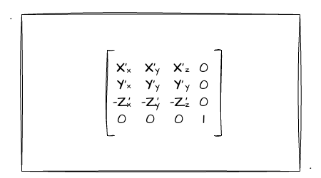

# 5. 实战相机渲染引擎

上一节我们深入地了解并推导了视图矩阵，完全的数学推导多少有点枯燥无味了，所以我们想办法让其炫酷起来。推导得这么辛苦，当然是得实战体验一波效果啦！所以本节将通过 javaScript 实现视图矩阵，实战一个简易的相机渲染引擎！

既然要自己实现一个相机渲染引擎，那肯定有一些需求点的。所以在实战内容开始之前呢，先大概讲讲本次实战要实现的功能：
1. 同时平移视点、观察点，实现图形的**反方向平移效果**
2. 仅改变视点，实现**不同角度**地观察图形

那么，让我们带着上述的两个需求点开始本文的实战内容吧！

## 用`js`实现视图矩阵

我们要想实现一个简易的相机渲染引擎，毫无疑问首先要用 `js` 实现一个**视图矩阵**（而我们的定点着色器核心代码依然是一个坐标点左乘视图矩阵而已）。也就是说，当我们给相机传入不同的 视点、观察点、上方向 数据时，浏览器最终会渲染出不一样的图像呈现在我们面前。


### 1. 创建`ViewMatrix`类
首先我们创建一个视图矩阵的 `class`，并且初始化一个单位矩阵在它的 `elements` 属性中：

```js
class ViewMatrix {
  elements: number[]

  constructor() {
    this.elements = [
      1, 0, 0, 0,
      0, 1, 0, 0,
      0, 0, 1, 0,
      0, 0, 0, 1
    ]
  }
}
```

在上述的基础上，我们给 ViewMatrix 添加一个 `lookAt` 的方法。简单处理，这个方法接收 `9` 个参数，包含 视点、观察点、上方向 三种数据的 `x、y、z` 值。直接通过 ts 的定义来看看吧： 

```ts
// c...代表相机；t...代表观察点；u...代表上方向
interface TLookAt {
  (cX: number, cY: number, cZ: number, tX: number, tY: number, tZ: number, uX: number, uY: number, uZ: number): void
}
```

ok，`lookAt` 方法中，我们就要按照上一节对视图矩阵中 `x、y、z` 轴的推导转化为 js 中的实现。最终就要实现当给其传入不同的 视点、观察点、上方向 数据后可以得到对应的视图矩阵！我们马不停蹄开始旋转矩阵的实现！

### 2. `lookAt`中的旋转矩阵

这里，我们简单回顾一下上一节我们推导出来的**旋转矩阵**：



因此，我们需要做的就是把矩阵中 `X'、Y'、Z'` 的值都求出来就行了。这一点对我们来说并不困难，因为上一节我们对每一个值进行了推导，这里更多的是用 js 套用数学公式来实现而已。

但这里我们要注意一点：**WebGL中的矩阵是列主序**。这一点之前在[矩阵实战图形变换](/content/四、WebGL二维动画/3.%20用矩阵实战图形变换.html#矩阵实战平移)中有提到。因此，在我们实战过程中，我们**要把数学推导出的行主序的矩阵做一个转置**，以最终传递到 WebGL 中使用。

首先，我们来实现旋转矩阵的`Z`轴求解。上一节讲过，求两点之间形成的向量，用后者减前者即可（忘记的回顾一下前文）。所以，我们只要把 观察点坐标 减去 视点坐标，求得的就是相机的`Z`轴。将实现放到代码里，其实就是：
```js
// t...代表观察点；c...代表相机；
zX = tX - cX
zY = tY - cY
zZ = tZ - cZ
// 以下是归一化实现
zToNormal = 1 / Math.sqrt(zX * zX + zY * zY + zZ * zZ)
zX *= zToNormal
zY *= zToNormal
zZ *= zToNormal
```

代码中，使用观察点减视点坐标求得 `zX、zY、zZ` 坐标后，还做了**归一化**处理。

那么归一化是什么？为什么要把向量归一化处理呢？笔者是这么理解的：归一化可以将矢量等比例变化，从而转换为**单位矢量**。因为我们这里要求出的**相机的坐标系**，所以我们仅需要关注矢量方向，不用关注模长。（感兴趣的朋友自行查阅相关资料吧）

概念性的东西，我们知道就行了，更关键的是我们需要知道怎么用。所以接下来一起看看归一化用公式如何表达。当前，把`|Z|`记作为`Z`的模长（**模长为`Z`轴上每个分量的平方相加后再开方**）；此时把`Z`轴归一化即为：
```
Z' = Z / |Z|
```
我在代码中把他们写成 `zX *= zToNormal` （乘的是一个倒数），其实就是相除法。至于为什么这么写，是有关矢量除法的问题（详细的我也没太了解清楚，求个数学大牛来教学教学）。anyway吧，暂时可以不用在数学上研究这么深入，懂得运用就好。


如何求三维矢量的叉积？我们回顾之前看过的[维基百科](https://zh.wikipedia.org/zh-hans/%E5%8F%89%E7%A7%AF)对**矢量叉乘**的说明：


:::demo
fifth/5_1
:::
