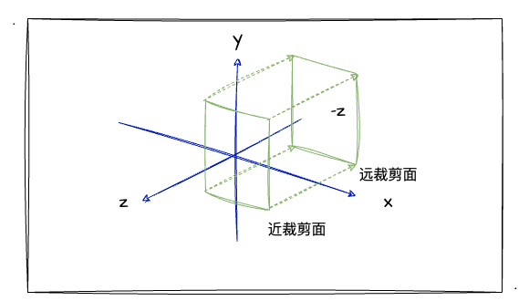
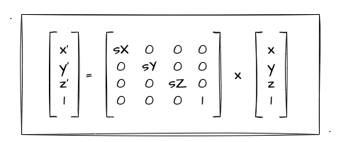
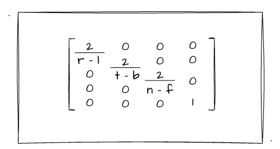
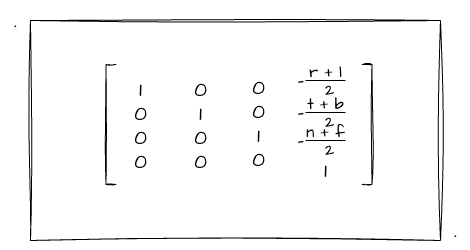
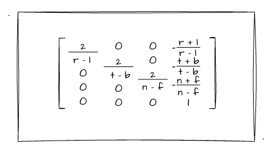

# 6. 相机的投影

经过前几节的学习，我们已经了解相机的概念，明白了相机对于 3D 图形绘制的重要的作用。但是我们仅仅分析了相机是如何观察图形的，却还没有提到可视范围，所以我们这一节就来一起探究一下相机的可视范围吧！

## 了解投影变换

上一节推导视图矩阵中，我有提过 MVP 矩阵。那其中，M就代表模型矩阵；V就代表了视图矩阵；而P就代表了本文要介绍的投影矩阵（Projection）了，也就是跟投影变换息息相关的矩阵知识。

基于上一节，我们理解了视图矩阵的概念其实就是把世界坐标系中的场景"放"到相机坐标系中，效果相当于相机在某个角度对场景进行拍摄，以最终呈现出图像绘制到屏幕上。但其实，最终成像的效果还有最后个环节——投影。那投影又是什么呢？我们接着往下看。

投影投影，顾名思义就是把物体投射到平面上，更简单的说，应该是一个场景从3D到2D的转换变化。毕竟，绘制的图像最终是在2D的屏幕中呈现给用户的。图形学中的投影变换有两种：**正交投影**、**透视投影**。关于**正交投影**和**透视投影**的区别，这有一张非常经典图快速帮助我们理解：


由上图我们可以看出，在两种不同的投影变换下，相机"拍摄"的可视空间、最终城乡都有所不同。其中，透视投影（左）的可视范围呈锥体，成像效果"近大远小"；而正交投影（右）的可视范围呈长方体，成像效果不随场景距离远近的而发生变化，呈平行光照的投影效果。

## 正交投影

接下来，我们详细了解一下正交投影。回到上文的图中，我们可以发现不论是正交投影还是透视投影，他们都有一个 Far clip plane 和 Near clip plane 的平面（远近裁剪面）。他们共同决定了相机的可视空间（在远、近裁剪面区间内的空间为可见），并且我们不难发现，正交投影中的远近裁剪面的大小是一致的，所以相机拍摄的空间为一个长方体！(主要看**图右**)


我们再接着看正交投影图中的近裁剪面，这里我们可以发现红、黄两球被投影到二维空间中，并且他们呈现出"等大"的图像，也就是说他们**不存在**"近大远小"的现象（对比透视投影中的近裁剪面看更明显）。

讲到这里，我们想一个问题：要怎么才能把一个3D图形转换为正交投影后的2D图形呢？问题不难，我们记住一个点即可，正交投影的效果**与深度无关**。换句话说，我们只需要 **`X、Y` 平面** 中的图形即可，所以只要留住`X、Y`的坐标数据，至于`Z`轴的数据直接丢掉即可！其实就是把图形"拍扁"！

这么说可能有点抽象，我们可以通过一个实际的算式来描述何为"拍扁"。比如我们把一个有深度（`Z`值不为`0`）的齐次坐标左乘以下矩阵：

```js
this.elements = [
  1, 0, 0, 0,
  0, 1, 0, 0,
  0, 0, 0, 0, // 这一行全部为 0，矢量左成后 Z 的值即为 0
  0, 0, 0, 1
]
```

回顾矩阵乘法中单位矩阵的特点：**任何矩阵与单位矩阵相乘都等于本身**。因此，我们把有深度的矢量左乘上述矩阵后，就将其`Z`的值变为`0`了，这就是一个"拍扁"的实现，这是不是比较好理解了呢？

另外，我们想一下前文提到的可视空间，远近裁剪面好像并没能在上述的矩阵中反应出来。默认渲染情况下，由于WebGL中的坐标系的范围是`[-1, 1]`，所以超出这个范围内的图形将被丢弃。所以，这也就解释了为什么上一小节我们实战相机渲染引擎的示例程序中，图形在某种情况存在被裁剪的现象：


如上图所示，绿色的三角形在相机旋转一定角度后被裁剪。根据这一个显示情况，我们有没有办法能在正交投影中给其**自定义一个可视空间呢**？我们接着往下看。



上图是**相机经过视图变换**后的情况，坐落于世界坐标轴中心，上方向与`Y`重合，并且看向`Z`轴的负方向。并且可以发现图中的绿色立方体，它所代表相机的拍摄空间，也就是正交投影的可视范围区间。

当然，上图中我们很难通过一定的数字化信息将这个可视区域的长方体表示出来。紧接着，我们给他添加 `left、right、top、bottom、near、far` 点位，使其可以通过**具体数值**的方式体现出位置、大小等。如下图：


由上图可以看出，正交投影可视区域的长方体的相关信息可以转化为如下：
1. `X`轴。可通过 `left、right` 两点表示
2. `Y`轴。可通过 `top、bottom` 两点表示
3. `Z`轴。可通过 `near、far` 两点表示

此时想象一下，如果我把这个长方体的可视区域，通过缩放变使得`X、Y、Z`轴的宽度都变成`[-1, 1]`的区间范围（也就是长度为`2`），并且再将整个长方体**移动到世界坐标轴的中心**，这样我们是不是就把整个长方体的可视区域在自定义范围的情况下变换到了世界坐标轴了呢？

因此，对于投影变换，又可以分成两点：
1. 将长方体缩放到`[-1, 1]`区间范围内。
2. 移动长方体到坐标中心。

## 推导正交投影矩阵

经过前文对正交投影的了解，我们知道了正交投影是一种类似平行光照的投影，没有近大远小的视野效果，并且有一个长方体的可视空间决定视野范围。接下来，我将推导并用js实现这个正交投影变换的关键——正交投影矩阵！

首先要做的是将可是区域缩放为变长为`2`的长方体（WebGL的坐标范围`[-1, 1]`）。这里，我们简单回顾一下之前推导过的[缩放矩阵](/content/四、WebGL二维动画/3.%20用矩阵实战图形变换.html#实战其他的变换)：



由上可以看出，缩放值`sX-sZ`（缩放因子）位于矩阵的**对角线**中，满足 `x' = sX * x`。回到本文，也就是我们要把`left到far`的值经过缩放计算后放到对应的位置即可。解下来看看怎么求出长方体的`sX`的值。当前`X`轴的长度是`right - left`，`x'`的目标是`2`（因为缩放至边长为`2`），所以可以求得`sX`为：

```js
sX = 2 / (right - left)
```

`sY、sZ`亦是同样的计算方式，最后我们可以得到正交投影矩阵的**缩放矩阵**如下：



紧接着，我们要把长方体平移到坐标原点。平移矩阵我们应该比较熟悉了，这里就不展开介绍了。我们只要计算出如何将`X、Y、Z`轴移动到坐标原点，再放到矩阵的**最后一列**即可。



如上图就是把长方体平移到坐标原点的平移矩阵。这里注意需要取负号，跟上一节平移相机到原点是一样的道理！那现在，我们已经分别求得出正交投影的缩放、平移矩阵，现在我们把这两个矩阵相乘就可以得到**正交投影矩阵**了。矩阵乘法都很熟悉了，这里也不再推导了，直接看结果：



上图就是将缩放、平移矩阵做乘法得到的正交投影矩阵了！紧接着，我们跟上一节一样，将正交投影矩阵在 `OrthographicMatrix` 类中实现！

## 实战正交投影矩阵

我们首先创建一个 `OrthographicMatrix` 类，其中有 `setOrthographicPosition` 方法：

```ts
class OrthographicMatrix implements TOrthographicMatrix {
  elements: Float32Array

  constructor () {
    this.elements = new Float32Array([
      1, 0, 0, 0,
      0, 1, 0, 0,
      0, 0, 1, 0,
      0, 0, 0, 1
    ])
  }

  setOrthographicPosition (left, right, top, bottom, near, far) {
    
  }
}
```

其中 `setOrthographicPosition` 接收`6`个参数，即前文我们提到过的相应值，如 `left` 传入的是长方体可视区域 `-x` 的值，以此类推...并且通过对缩放因子、平移位置的计算后，代入到矩阵对应的位置中就行了！具体的计算、换算过程就不再演示了，跟上一节一样的，这里还是要提醒一下，记得传入**WebGL中的矩阵是列主序**！

```ts
// 缩放位置
e[0] = 2 * rl
e[5] = 2 * tb
e[10] = 2 * nf

// 平移位置
e[3] = (right + left) * rl
e[7] = (top + bottom) * rl
e[8] = (near + far) * rl
```

上述代码即为正交投影矩阵的核心实现了，这里因为基于单位矩阵实现的，所以我们只需要改变矩阵对应位置中的对应值即可。紧接着，我们通过一个示例程序，来实战应用这个正交投影矩阵！

这里我们要对之前用的顶点着色器进行一下修改（主要还是因为我没在js中实现矩阵乘法），新增一个 `uniform` 变量 `u_OrthographicMatrix`，并用**视图矩阵左乘**它。简单看看代码：

```glsl
uniform mat4 u_OrthographicMatrix;
uniform mat4 u_ViewMatrix;

void main () {
  gl_Position = u_OrthographicMatrix * u_ViewMatrix * a_Position;
  v_Color= a_Color;
}
```

上述 `gl_Position` 的值则是通过视图变换、正交投影变换得到的顶点坐标值。（这里我也是借助了 WebGL 原生支持**矩阵乘法**偷了波鸡）剩下的代码跟之前的没什么不同了，只是我们要多拿一个 `u_OrthographicMatrix` 变量并给他赋值，这里赋值的就是我们的正交投影矩阵了！

那为了好让大家感受到**自定义可视空间**的存在，我把上一节的示例程序中的三个三角形都扩大到WebGL的坐标系区间之外。比如我把他们的顶点坐标调整到如下（为方便查看，已删除颜色值）：

```js
[
// 绿
0, 1.6, -0.6, 
-1.5, -1.4, -0.6,
1.5, -1.4, -0.6,
// 蓝
0, 1.5, -0.4,
-1.5, -1.5, -0.4,
1.5, -1.5, -0.4,
// 橙
0, 1.4, -0.2,
-1.5, -1.6, -0.2,
1.5, -1.6, -0.2,
]
```

上述点坐标中，一眼就看到了我给三个三角形的`X、Y`坐标都加了`1`（已经超出了WebGL的坐标系范围了），这样一来我们如果不做正交投影变换的话，图形超出部分一定是被丢弃掉的！现在加上正交投影变换以自定义可视区域，即使一开始定义的坐标远超WebGL的坐标系范围，但是只要调整我们区间范围，在**自定义的可视区域内依然可以看清它的全貌**！


话不多说，直接上示例程序大家自己操作玩一下：

:::demo
fifth/6_1
:::

## 总结

本文的最后，跟大家一起回顾本文的主要内容：
1. 了解什么是投影，正交投影和透视投影的概念性区别。
2. 正交投影的关键是正交投影矩阵。矩阵的由来是将可视长方体变换到坐标轴中心的**缩放矩阵和平移矩阵的乘积**
3. 推导并实战了正交投影矩阵，实现了自定义可视区域观察图形
