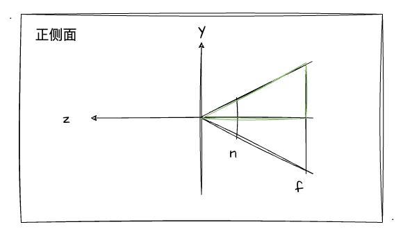
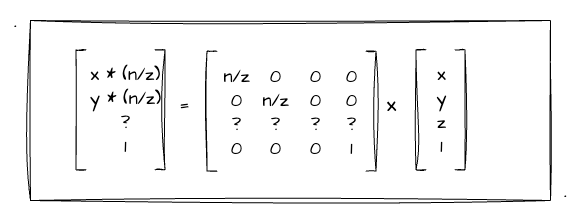
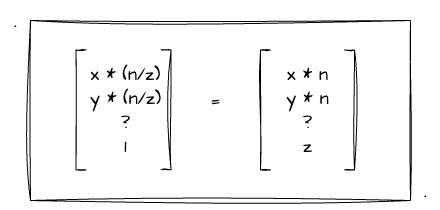
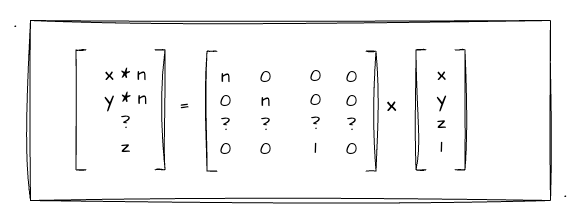
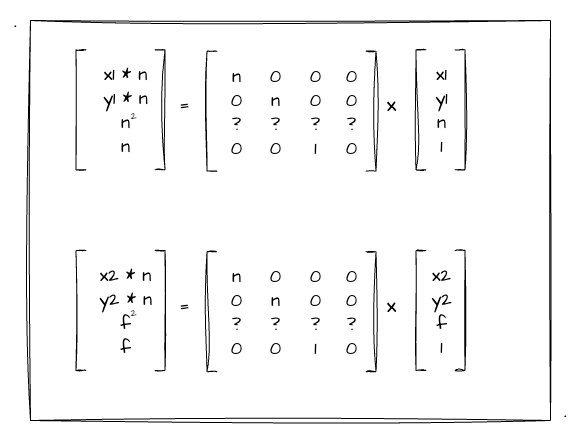
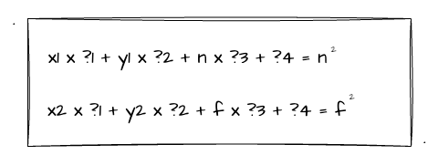
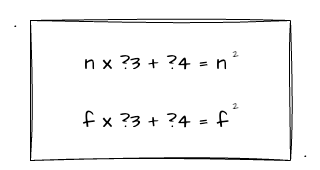
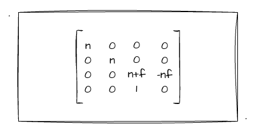
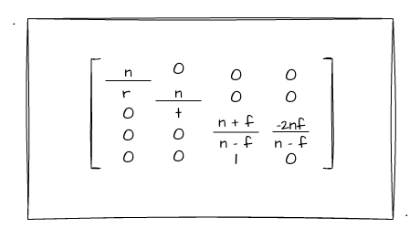

# 7. 透视投影

经过上一节的学习，我们已经了解并实战使用了投影之一的正交投影！那么本节，我们趁热打铁，把更贴近生活场景、更接近视觉效果，并且也是更难的透视投影也一探究竟吧！

## 了解透视投影

那么上一节也有提到透视投影，它更贴近生活，符合我们人的视觉效果，会有近大远小的现象。当然，这种投影的使用程度也是更加的广泛。跟上一节学习的正交投影的可视空间是长方体的不同，它的可视区域是一个类四棱锥，我们可以通过下图来回顾一下（左图）：


由上图（左）可以发现，透视投影的可视区间是四棱锥中的远近裁剪面决定的，近裁剪面跟远裁剪面之间形成了一个四棱台（近裁剪面小于远裁剪面）。并且图像会投影到近裁剪面上，这也是最终呈现在显示器上的图像结果。

这里，我们跟上一节一样，通过图、描点的方式，把透视投影的可视区域表达出来！当然，因为它不再是长方体结构，所以我们要分别对远近裁剪面进行描点～如下图：


上图中，我们依然通过 `left、right、top、bottom、near、far` 点位对透视投影的可视区域进行描述。与正交投影的不同的是，远近裁剪面大小不相同，所以对于 `top、bottom、left、right` 值我们分别对两个面进行标注。

这里我们可以试想一下，如果我们将远裁剪面进行一定的压缩，变成跟近裁剪面**等大的长方形**，那可视空间不就又回到了我们熟悉的**长方体**了吗？如此一来，只要我们把这个长方体移动到世界坐标原点吗，再缩放到`[-1, 1]`区间范围，不就是我们刚学完的正交投影变换吗！

所以，我们应该如何构造出这个长方体？简单来说就要压缩远裁剪面，把它压成近裁剪面大小。

比如说现在空间中有一个点`A(x, y, z)`，我们要做的就是把`x`压缩成`xA`，把y压缩成`yA`。我们先不着急想要怎么压缩，先找找透视投影可视区域有什么样的规律或者特性。比如现在我们从**正侧面**观察这个四棱台的特性：



上图中我描了绿色边的三角形在我们的九年义务教育中它叫啥？**相似三角形**有没有？那相似三角形的特性之一：**三组对应边均成比例**对此至关重要！为什么这么说？我们接着把案例（点`A`）代入进图中观察：


如图，当我们把`A`点进行压缩时，它最终压缩到的对应位置为`A'`，那此时，它的`Y`轴坐标将由原来的`y`变为`yA`。由于`A'`和`A`围成三角形为**相似三角形**，所以对于`y`轴的压缩值，我们可以通过以下等式来表示：

```js
// z是A点的z坐标值，n是近裁剪面的z坐标值；
z / n === y / yA
// 变换为：
yA = y * (n / z)
```

也就是说，对于变换后的 `yA` 来说，它的值等于 `y` 乘 `n/z` 的结果。同理，我们以同样的方式对`X`轴的坐标值进行转换。比如现在我们从**正上方**观察四棱台：


没错，跟从正侧面的规律是一样的，依然是相似三角形，依然是有**三组对应边均成比例**这个重要特性。并且，我们通过推导可以发现，`X`跟`Y`轴坐标的变换公式其实是一样的：

```js
// z是A点的z坐标值，n是近裁剪面的z坐标值；
z / n === x / xA
// 变换为：
xA = x * (n / z)
```

因此，我们可以得出一个结论：**对于可视空间四棱台中每一个坐标的`x、y`值都乘上 `n/z`，就可以把这个四棱台变换成一个长方体了**！

## 透视投影矩阵

根据前文做的推导，我们得知将透视投影的四棱台压缩成长方体其实就是将所有的`x、y`坐标值值都乘上 `n/z`，于是我们可以将值直接代入到矩阵当中：



没错，我们仅仅对`x、y`的值进行代入，毕竟我们还没有求跟`Z`轴变化有关的值，所以`z`值（矩阵第三行）相关的位置都是`？`。那我们有没有办法从已知的信息中来推导这一行的未知数呢？这里我们回顾一下之前第二章学习过的[WebGL绘制点](/content/二、WebGL基础/2.%20WebGL绘制点.html#编写简单的着色器代码)中提到的齐次坐标，它的特性是： `(x, y, z, w)` 其实等价于三维坐标 `(x/w, y/w, z/w)`。

因此，我们可以推导出**齐次坐标`(x, y, z, w)`等于`(xn, yn, zn, wn)`**，四个分量同时乘上一个常量值`n`依然是等价的！所以，我们可以给前文求到的齐次坐标的每一个分量都乘上一个`z`值，可以得到：



这样有什么用呢？别急，我们接着往下看。当我们给齐次坐标得每个分量都乘上一个`z`值后，再将其代入到矩阵乘法中，我们可以把矩阵中的`z`消除！如下图：



由上图，我们可以看出跟首次推算出来的矩阵有所不同，矩阵中第一、第二行已经**没有了`z`的值**，并且矩阵的**最后一行也变成了 `0 0 1 0`**。由此，这个变化后的矩阵乘上其次坐标后正好满足 `[xn, yn, ?, z]` 的结果。接下来，我们需要想办法把第三行的`?`值求出即可，也就是要考虑`z`值的变化！

我们已知近裁剪面的`z`值为`n`，远裁剪面的为`f`，且他们为负数，满足 `f < n < 0`。并且，我们将四棱台变换成长方体的过程中，**远近裁剪面的`z`值是不会发生变化的**。现在假设有近裁剪面的一个点`(x1,y1,n)`和远裁剪面一个点`(x2,y2,f)`，我们将他们代入上述推断的矩阵中，他们应该满足如下等式：



我们按照矩阵乘法单独把第三行的计算抽出来，可以得到如下的关系式：



其次，远近裁剪面的`z`值跟`x、y`是无关的，所以我们可以把 `?1、?2` 设置成`0`，于是简化后我们可以得到一个相对简化的等式：



因此，我们可以推出：**`?3 = n + f`，`?4 = -nf`**。我们将其代入到上述的矩阵当中，可以得到如下矩阵：



经过这个矩阵的变化，我们已经将四棱台变换成一个长方体了，那最后的透视投影矩阵还差一把就是把这个**长方体给标准化**了。这么说好像很抽象，其实不然，只要将其再乘上我们上一节所推导的**正交投影矩阵**就可以了！这里我就不展开了，直接给结果：


## 如何表示透视投影？

透视投影如何表示，或者说如何配置呢？回顾一下我们上一节是如何配置正交投影矩阵的？是不是直接通过 `left、right、top、bottom、near、far` 这些点位的相关值来配置的呢？但是透视投影并不是使用这些来表示和配置的，而是使用 `fov`、`aspect`、`near`、`far` 这四个值。我们简单看看他们分别是什么。

- fov：垂直方向视角，角度越大，视野越广，物体越小。具体可参考下图的**绿色角**

- aspect：近裁剪面的宽高比
- near、far：指定近、远裁剪面的位置

再回到我们之前的一张图中：


如上图，对应 fov 的角为 **`T1-原点-B1`**。并且，根据图我们可以知道，我们把**四棱台放到正中间**的时候，远近裁剪面都满足 `right`等于`-left`，`top`等于`-bottom`。所以，我们可以把`r-l`变为`2r`，`t-b`变为`2t`。于是，我们可以把前文推导出来的透视投影矩阵再做进一步的**简化**如下：



还记得前面我们设 fov 为`θ`的这一值吗？我们通过**三角函数**可以得到如下等式：


根据换算出来的等式，我们将其代入上述的矩阵中，可以将其完全转化成通过 `fov、aspect、near、far` 这四个值来配置。具体换算过程我就不逐步演示了，有兴趣的同学可以自行推导。直接看结果：


上图即为 fov 为 `θ`，宽高比为`a`时的透视投影矩阵了。

