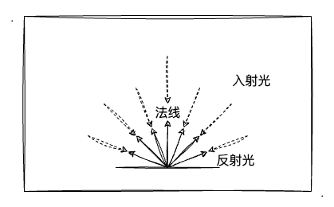
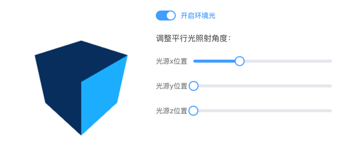

# 2. 环境光的漫反射

上一节的学习中，我们初步认识了光照并实战了平行光的漫反射效果，并且在文章的最后我也留下了一个疑问：现实中即使光线直射垂直`X`的面，但其余的面应该不至于是纯黑色的吧？所以这一节，我们就一起来探讨一下这个问题，看看环境光的漫反射如何让我们的立方体更加贴近现实。


## 环境反射

在上一节的学习中，我只提到了漫反射（针对平行光、点光源），但其实环境反射也是光照反射类型的一种。环境反射，由于没有特定的入射光源，所以直接就可以认为环境反射的反射光为入射光的反方向。如下图所示：



再回顾上一节学过的**环境光**的定义，**只需要定义颜色即可**，所以相比平行光来说要简单一些。我们看一下环境光如何计算求出：

```
环境反射光颜色 = 入射光颜色 x 物体表面颜色
```

上述等式即为求出环境反射光的公式了，相比平行光的漫反射光计算也是简化了不少。我们只需要知道**入射光颜色**，也就是我们定义的**环境光颜色**就可以了，接着就是跟物体原色之间的`RGB`的乘法了。

如果说一场景同时存在漫反射和环境反射，那物体最终被眼睛看到的反射光颜色呢只需要将**两种类型的反射光颜色相加**即可。公式如下：

```
反射光颜色 = 漫反射光颜色 + 环境反射光颜色
```

所以，当我们给上一节的示例程序添加多一种反射类型，会不会有不一样的效果呢？特别是当**光线垂直照射垂直`X`轴的平面时**，另外的两个面还是不是纯黑色呢？我们接着往下进入实战环节。

## 实战漫反射和环境反射

这里，我们给上一节的示例程序添加多一个环境光的反射类型，让立方体在光照下的表现更加贴近生活。基于上一节示例程序的代码，这里我们仅需要稍微改动一个顶点着色器和js的代码就可以了。

首先来看顶点着色器：

```GLSL
...
uniform vec4 u_AmbientColor; // 添加环境光颜色

void main () {
  ...
  vec4 ambient = a_Color * u_AmbientColor; // 计算环境反射光
  vec3 colorRes = vec3(u_LightColor) * vec3(a_Color) * dotProduct;
  v_Color= vec4(colorRes, a_Color.a) + ambient; // 将环境反射光和漫反射光相加
}
```

相比之前的示例程序，这里添加了 `u_AmbientColor` 变量，作为**环境光的颜色值**。并且在 `main` 函数中，通过环境反射光公式计算出了环境反射光。最后，将漫反射光和环境反射光相加后复制给变量 `v_Color` 传递到片元着色器中。

看到这里，还没实战我们大概也猜到效果了。当既有漫反射又有环境反射的时候，观察的立方体会更加的"明亮"，毕竟在计算好的漫反射光颜色中还要在加一个颜色值。而在很早之前的学习中（前端开发经验），颜色值`RGB`值越高，颜色越亮。

接着，我们看一下js方面的改动。其实也很简单，就是获取变量并传值的过程而已。

```js
const ENV_LIGHT_RGB = 0.36 // 环境光的值
const ambientColor = new Vector4(ENV_LIGHT_RGB, ENV_LIGHT_RGB, ENV_LIGHT_RGB, 1.)
gl.uniform4fv(u_AmbientColor, ambientColor.elements) // 传递给变量 u_AmbientColor
```

由于想给大家清晰体验有环境光和没环境光的区别，我添加了一个开关来控制是否设置环境光。当打开开关的时候，`u_AmbientColor` 的RGB值均大于`0`，而当关闭开关时，我把环境光设置为黑色`RGB(0, 0, 0)`。开关通过 Vue3 的 `watch` 来控制，感兴趣的朋友可以展开示例程序的源码查看。

:::demo
sixth/2_2
:::

如上示例程序，如我们所猜测的那样，当既有环境反射又有漫反射时，立方体的每个面的颜色会更加明亮些，并且当我们把平行光调整到**平行`X`轴入射**时，没有被平行入射光照射到的面也不会是纯黑色了，而是有暗蓝色。如下图所示：



## 总结

本文的最后，跟大家一起回顾本文的主要内容：
1. 环境反射主要针对环境光而言，我们仅需要定义环境光的颜色即可。
2. 环境反射光的计算公式：`环境反射光颜色 = 入射光颜色 x 物体表面颜色`
3. 既存在漫反射又存在环境反射时，反射光颜色为二者之和。公式：`反射光颜色 = 漫反射光颜色 + 环境反射光颜色`
4. 环境反射的现象：物体的颜色比起没有环境光时要更加**明亮**。
