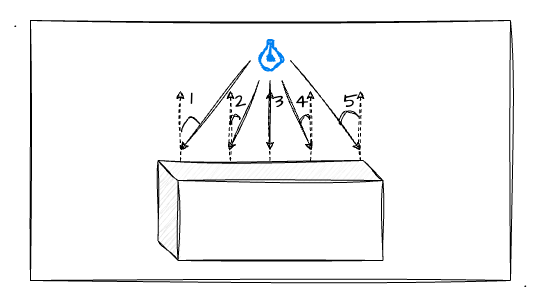

# 3. 初识点光源

前面两节，我们学习并实战了平行光、环境光的光照效果，了解了计算漫反射光、环境反射光的公式，这一节我们来学习另外一种光源类型——**点光源**，并且实战点光源的光照效果。let's go！

## 点光源

简单回顾下之前对点光源的介绍："**点光源**。是由点向周围发散的光（如灯泡），可以用**光源位置**和**颜色**来定义点光源。"没错，在点光源的定义中，跟另外两种光源也不一样，它的特别之处在于**光源位置**的定义。

因为点光源是**从一个位置发散开**的，所以它照射到物体表面的时候，**入射角都是不唯一的**，这也是跟平行光最大的区别。比如我们看下图：



比较明显的是随着**光的发散**，点光源照射到物体表面的**入射角是越来越大**的。那么基于之前对于**反射光颜色**的计算公式跟**入射角**的关系，我们可以分析出随着光源的发散，物体表面的颜色会逐渐暗淡。

简单总结一下这种情况的结论：**漫反射光的强度随着入射角的增大而减小**。其实这样符合生活常识，当我们开灯的时候，离灯光越远的物体就越暗。为了加深印象，我把上述的图稍微改造一下：


上图中，蓝色的半圆代表反射光的强度，半圆越大，反射光越强。如上图就比较清晰了，`点3`距离灯泡最远，所以它的入射角越大，反射光的强度也就越小，所以它也是三个点中光线最暗的，还是比较符合现实场景的。

## 实战点光源的漫反射

说到漫反射，我的第一反应就是漫反射光的计算公式：

```
漫反射光颜色 = 入射光颜色 x 表面颜色 x (光线方向 · 法线方向)
```

机灵的同学一下就反应到了，这不是平行光的漫反射光计算公式吗？没错，正是平行光的漫反射光计算公式。但其实，它也同样适用于点光源的漫反射光的计算。仔细想一下，前文分析点光源的特性，其实也还是入射角、光线方向等这些基本问题上。

:::demo
sixth/3_1
:::

## 逐片元优化

:::demo
sixth/3_2
:::

## 总结
