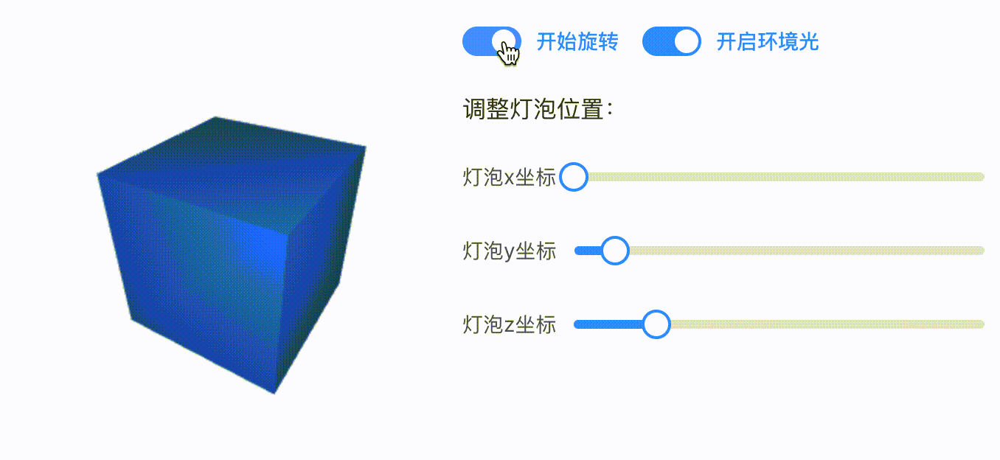
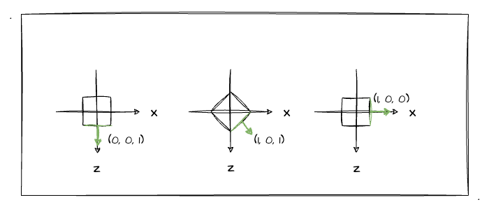

# 4. 光照与旋转

经过前面三节的学习与实战，相信大家对光照已经有所了解了，并且也知道平行光、环境光、点光源的一些光照效果了。但是不知道在之前的学习中你有没有想过一个**法向量相关**的问题，法向量在不断变化中的光照效果应该如何处理？

大家都知道，求点光源、平行光的**反射光颜色都跟法向量**有关（求入射光的夹角），但是之前的物体都是静止的。如果说现在有一个物体会有一个**自转**的动画，这个时候还按照之前的方式求反射光颜色还是我们预期的效果吗？

## 物体发生旋转会怎么样

其实我们大概可以猜出，当物体旋转时（以立方体为例），其中的某几个面的法向量是一直都在发生改变的。这样一来，再按照之前的反射光计算公式直接计算的话，可能就不是我们预期的效果了。

光说是不行的，我们直接通过一个实际的案例来看看效果会怎么样吧。这里我接着沿用上一节的实战案例——点光源的光照效果，并且在其基础上，给物体新增一个旋转的动画效果。

关于变换效果大家应该都很熟悉了，原理就是将**顶点坐标左乘旋转矩阵**即可，并且在当前这么多库的基础上，我们直接调`api`就行了。简单地看看实现代码：

```js
const animation = () => {
  // 设置绕 y 轴旋转，每次旋转 1 度
  baseMvpMatrix.rotate(1, 0, 1, 0)
  // 将新计算的 mvp 矩阵传入缓冲区
  gl.uniformMatrix4fv(u_MvpMatrix, false, baseMvpMatrix.elements)
  // 清除缓冲区数据
  gl.clear(gl.COLOR_BUFFER_BIT | gl.DEPTH_BUFFER_BIT)
  // 重新绘制
  gl.drawElements(gl.TRIANGLES, indices.length, gl.UNSIGNED_BYTE, 0)
  animationId = requestAnimationFrame(animation)
}
```

其实代码并不复杂，写了了一个基于 `requestAnimationFrame` 的运动函数，每次执行的时候会绕`y`轴顺时针旋转`1`度。直接通过示例程序看看效果吧：

:::demo
sixth/4_1
:::

当我们开启旋转动画时，可以发现这个点光源的光照效果会有些奇怪。明明光源的位置没有发生改变，但是**当立方体的背面转到点光源处时依然处于黑暗状态**。如下 gif 所示：



对于这一点我们也许并不意外，因为我们知道当前的反射光颜色是按照立方体初始化时候的法向量来计算的，所以只要我们的法向量没有随着旋转做相应的变化，立方体的表面颜色也不会发生变化。（感兴趣的同学可以套反射光计算公式自行推导一下）

## 旋转物体光照的正确打开方式

由前文的 demo 我们知道，若不根据物体变换后的位置**重新计算法向量**，此时立方体的光照效果是很奇怪的。所以这一小节，我们来看看如何让物体在旋转中依然有正常的光照效果。

首先，我画了个立方体的俯视图，以此来跟大家一起分析一下立方体在旋转后法向量的变化：



很显然，立方体在每次的旋转中，某几个面的法向量都在发生变换。如图中标了绿色的面，他的法向量随着旋转角度的变化也在不停的变化。因此，我们可以简单得出以下结论：
1. 物体平移不会改变法向量。
2. 物体旋转会改变某些面的法向量。

当然，物体的缩放变化也是有可能会引起法向量改变的，但是目前暂时不涉及到它的讲解，本文只针对旋转的情况来考虑。

好了，接下来我们只要能求出某些面因旋转而改变的法向量后，求出正确的光照效果就不在话下了。这个时候，一个矩阵又跳出来了——**逆转置矩阵**。所以说，图形学中，数学真的非常重要。

什么是逆转置矩阵？其实就是**逆矩阵的转置**。简单来说，逆矩阵的就是跟原矩阵相乘为单位矩阵的矩阵，而转置则是把矩阵的行列做一个对调。这些矩阵的概念之前都有提到过，还是不熟悉的同学自行去了解下吧。

接下来，我们就来看看如何得出一个**逆转置矩阵**，它是谁的逆、是谁的转置？这里大家可能都猜到了，其实就是**模型矩阵**（旋转矩阵）。回想一下，我们的顶点坐标，通过左乘一个模型矩阵即可进行变换操作，只要以这一个**模型矩阵为基础**，做一个**逆转变换**便是我们期望得到的**逆转置矩阵**了。

前面铺垫了这么多，大家应该也就猜到了：只要将法向量左乘这个逆转置矩阵就可以得到变换后的法向量了。因此，我们分两步走：
1. 求模型矩阵的逆矩阵
2. 将逆矩阵进行转置操作

对于具体的逆矩阵、转置矩阵操作，我就不一一推导实现了，直接调用现成的工具库——[cuon-matrix](https://github.com/jorgen-17/cuon-matrix-ts)。于是乎，我们直接进入实战环节，看看能不能实现立方体在旋转中的光照效果！

:::demo
sixth/4_2
:::