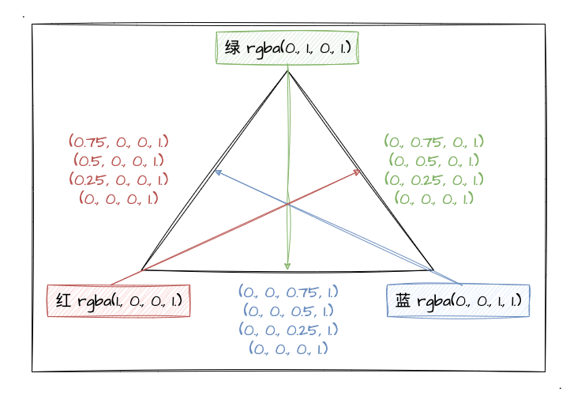
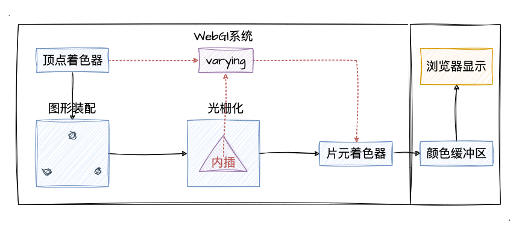

# 5. 逐片元的点光源

前面我们已经对点光源的光照效果进行初步学习和实战了，也亲自体验了一番点光照效果！但是你是否还记得之前我留下的一个问题——**用顶点着色器来处理点光源是有点不足**呢？没错，这一节我们就从这一问题出发，深入理解它的不足，并且想办法通过更优的方式来实现点光源的光照效果。

## 逐顶点的不足

之前的 [初识点光源](/content/六、WebGL光照/3.%20初识点光源.html) 中，我在文章结尾部分大概分析了一下逐顶点实现点光源的不足，一句话概括就是：**"内插"的作用下的点光源光照效果并不自然**。不过仅仅一句话很难让初学者get到它的点，所以这里，我决定通过上一节的示例程序来让大家深刻体验一下逐顶点实现的点光源光照效果的不足。

:::demo
sixth/4_2
:::

可能拥有想素颜的你早已发现，点光源关照效果的**直线**感会很强。如上的示例程序，你认真看关照效果**从亮到暗过度的地方其实是比较生硬的直线**。当立方体旋转起来的时候，依然可以看到比较生硬的光亮面和暗面的衔接效果，比如下图：


如果说此时的你没有发现有什么直线的过度区域，不要紧，因为我是要给你做对比的。当然啦，上图已经有一些直线感了...就是在我用箭头指向的地方。接着我们再看看当立方体的旋转角度再增加了一点的时候，如下图所示：


这样看是不是就比较明显了呢？我直接把生硬的部分划出来，可能就更清晰了：


看到这里，如果你再回去仔细地观察示例程序，在旋转到某些角度时，你一定会发现生硬的过度效果，因为真的有点明显！产生这种生硬过度效果的原因便是内插过程，因为不同顶点有不同的颜色值，所以最终绘制出来的平面的颜色，是各顶点之间内插后的效果。

想详细了解内插行为的可以看我之前写的文章——[为什么会出现颜色渐变](/content/三、WebGL颜色和纹理/2.%20为什么会出现颜色渐变.html)，该文章较为深入的讲解了内插的产生和效果。这里我附上两张图，帮即将遗忘内插的同学做一个快速回顾～




## 实战逐片元光照

其实我们之前有大概了解过图形的渲染流程，如下图所示：



由上图可知，片元着色器会对把光栅化后的每一个像素点进行着色，这也给我们提供了**对每一个像素点进行光照效果计算**的可能。详细了解依旧可以戳 [为什么会出现颜色渐变](/content/三、WebGL颜色和纹理/2.%20为什么会出现颜色渐变.html) 这篇文章。

所以对于逐片元的光照效果，我们需要把之前对光照的计算**从顶点着色转移到片元着色器**中来，这是最关键的一步。由此一来，顶点着色器需要向片元着色器传递诸如法向量、`varying`坐标等数据，这样片元着色器就具备计算光照颜色的条件了。

因此我们最先要理清楚，什么数据是片元着色器所需要的，再一步一步地敲代码。回顾**点光源的漫反射光**计算公式：

```
漫反射光颜色 = 入射光颜色 x 表面颜色 x (光线方向 · 法线方向)
```

因此，我们**片元着色器**中需要有以下数据：
1. **入射光颜色**。这个之前我们是通过 `uniform` 变量获取的，直接移到片元着色器即可。
2. **物体表面颜色**。表面颜色是定义**顶点数据**的时候定的，每个面都是蓝色。但是可能存在不同点之间的颜色不一样，所以可能存在内插的现象，因此需要**通过 `varying` 变量从顶点着色器传递到片元着色器**。
3. **点光源的位置**。因为要计算光线方向，所以片元着色器中需要有点光源的位置信息。
4. **对应片元的位置信息**。也是因为要**计算光线方向**，所以需要每个片元的世界坐标信息，这一步也可以通过 `varying` 变量从顶点着色器中传递到片元着色器。
5. **法向量**。对于法向量，因为可能存在旋转等变换，可以在顶点着色器中计算好后同样通过 `varying` 变量传递。

确定好基本的片元着色器所需的数据后，我们可以着色改造代码了，首先是顶点着色器的代码改造：

```GLSL
attribute vec4 a_Position;
attribute vec4 a_Color;
attribute vec3 a_Normal;
varying vec4 v_Color; // 物体颜色，传给 frag
varying vec4 v_Position; // 片元坐标点，传给 frag
varying vec3 v_Normal; // 法向量，传给 frag
uniform mat4 u_MvpMatrix;
uniform mat4 u_ModelMatrix;
uniform mat4 u_NormalMatrix;

void main () {
  // 这里跟之前一样，仅仅是MVP变换
  gl_Position = u_MvpMatrix * u_ModelMatrix * a_Position;
  // 将变换后的顶点坐标赋值给 varying 变量，传给 frag
  v_Position = u_ModelMatrix * a_Position;
  // 计算变换后的法向量赋值给 varying 变量，传给 frag
  v_Normal = normalize(vec3(u_NormalMatrix * vec4(a_Normal, 1.0)));
  // 直接将顶点的颜色赋值给 varying 变量，传给 frag
  v_Color = a_Color;
}
```

其实乍眼一看，顶点着色器的代码比之前轻量了一丢丢，因为颜色的计算过程并不在其中了。接着我们来看片元着色器的改造：

```GLSL
precision mediump float;
varying vec4 v_Color; // 接收物体颜色值
varying vec4 v_Position; // 接收顶点坐标（内插后）
varying vec3 v_Normal; // 接收法向量
uniform vec4 u_LightColor; // 入射光颜色
uniform vec3 u_LightPosition; // 点光源位置
uniform vec4 u_AmbientColor; // 环境光颜色

void main () {
  // 拿内插后的 v_Position 计算出对于当前片元的光线方向
  vec3 lightDirection = normalize(u_LightPosition - vec3(v_Position));
  // 求光线、法向量点积
  float dotProduct = dot(v_Normal, lightDirection);
  // 计算环境光
  vec4 ambient = v_Color * u_AmbientColor;
  // 计算漫反射光
  vec3 colorRes = vec3(u_LightColor) * vec3(v_Color) * dotProduct;
  // 漫反射光 + 环境光 赋值给内置变量 gl_FragColor 以完成上色
  gl_FragColor = vec4(colorRes, v_Color.a) + ambient;
}
```

整个的计算过程其实跟之前的点光源计算是一样的，只是片元着色器不再是简单粗暴的将 `v_Color` 值赋值给内置变量 `gl_FragColor` 了，而是在片元着色器中对当前片元的光线方向进行计算，从而求出对应当前片元的反射光颜色值。

接下来，我们通过示例程序来看看逐片元的点光源的光照效果：

:::demo
sixth/5_1
:::

其实认真比对可以发现，通过逐片元实现的点光源光照效果确实更加平滑，基本上不会出现生硬的过度，一切效果都更加贴近现实生活。

## 总结

本文的最后，跟大家一起回顾本文的主要内容：
1. 逐顶点的点光源光照的过度效果稍微生硬。
2. 逐片元的点光源光照效果更加平滑。
3. 逐片元逼真效果的关键点在于将反射光的计算细粒度到每个像素上。
4. 片元着色器通过 `varying` 变量的获取顶点坐标、物体表面颜色，并且在片元着色器中计算当前位置的反射光情况。