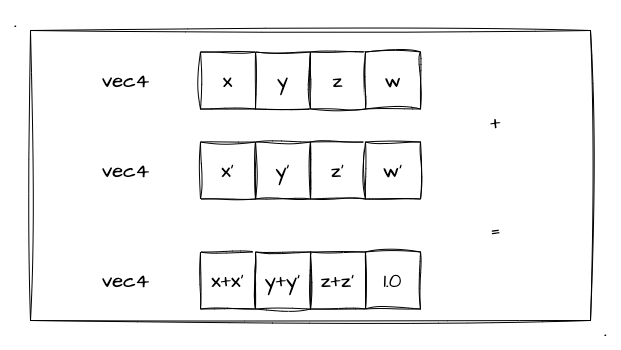
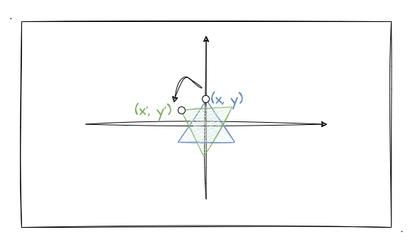

# 1. 会动的三角形

从这一章开始，我们将开始新的 WebGL 学习方向，一起探究如何实现 2D 图形的基础变化，如何实现基础的动画效果。这也是为我们后续学习 3D 图形绘制、动画的基础！看到这一章节的时候，不知道你还记不记得如何绘制点、线、三角了，要是忘了的话赶紧翻一翻前面的内容回顾一下。

在进入动画领域之前，首先让我们来一起研究如何通过 平移、旋转、翻转 来让一个三角形简单地"动"起来，let's go！

## 平移

首先我们得回顾一下如何绘制一个三角形：
1. 确定顶点坐标，存放到缓冲区对象中
2. 顶点着色器消费缓冲区数据，并赋值给 `gl_Position`
3. 片元着色器给三角形涂上颜色
4. 最后通过 `gl.drawArrays(gl.TRIANGLE_xxx, 0, 3)` 进行绘制

为什么在讲平移之前要大家先回顾三角形的绘制流程呢？因为当你回顾完一个静态的三角形是如何绘制后，你就会发现，确定三角形绘制位置相关的数据无非就是**三个顶点坐标**。所以如果我想要实现三角形的平移，那我只需要**同时**将三个顶点坐标值进行加减法操作即可。


如上图所示，当我们把蓝色三角形移动到绿色三角形的位置，无非就是三个顶点的 `x` 值都加上**水平方向的位移值**，`y` 值都加上**垂直方向上的位移值**而已。也就是图中的坐标从 `(x,y)` 移动到 `(x',y')` 的改变而已。坐标调整完后，我们再重新绘制一次就能实现三角形的平移了。

基于这一点，本文的目标终于从上一章节的片元着色器又转到**顶点着色器**了。现在我基于第二章的三角形的顶点着色器代码，再对其进行一个小改造：

```js
const vertexCode = `
  attribute vec4 a_Position;
  attribute vec4 a_Color;
  varying vec4 v_Color;
  // 增加一个 uniform 变量来接收变化的位置坐标值
  uniform vec4 u_Position;

  void main () {
    // 将两个位置坐标进行相加
    gl_Position = a_Position + u_Position;
    v_Color= a_Color;
  }
`
```

基于以上的顶点着色器实现，我只需要把每次改动后的坐标给到 `uniform` 变量 `u_Position` 再重新绘制图形就能实现一个可以平移的三角形了。这里我以 `x` 轴平移为例，讲解下实现 `x` 轴平移的代码：

```js
// 监听了控制 x 滑块的变化
watch(xVal, x => {
  // 获取 uniform 变量
  const u_Position = gl.getUniformLocation(program, 'u_Position')
  // 准备传递给 uniform 变量的移动距离数据（注意最后一个值为 0.）
  const xMoveVertices = new Float32Array([x, yVal.value, 0., 0.])
  // 将位移数据赋值 u_Position
  gl.uniform4fv(u_Position, xMoveVertices)
  // 重新绘制三角形
  gl.clear(gl.COLOR_BUFFER_BIT)
  gl.drawArrays(gl.TRIANGLES, 0, 3)
})
```

简单来看，上述代码就是将偏移值给到 `u_Position` 变量，再重新绘制三角形（重新运行着色器代码：原始值+位移值）。那其实两个矢量相加，就是矢量中的每个分量分别相加，跟我们**上一章最后一节多纹理提到的颜色相加是同一个道理**。详细我们看下图：



这里我们需要注意一点就是 **`xMoveVertices` 这个 `vec4` 类型的值的最后一位需要是 `0.`**。因为 **`a_Position` 中的最后一位值已经是 `1.0`**，而在齐次坐标中有这样的一个关系：齐次坐标 `(x, y, z, w)` 其实等价于三维坐标 `(x/w, y/w, z/w)`。因此，最后一个值 `w` 会影响 `x`、`y`、`z` 的值，所以我们这里要保持它的值为 `1.0`（如果忘了的同学可以再回去看看[第二章第二小节](/content/二、WebGL基础/2.%20WebGL绘制点.html#编写简单的着色器代码)）。

以下是三角形 `x`、`y` 轴平移的示例程序，大家可以亲自操作感受一下，拖动滑块来改变三角形的位置。相关的代码实现直接参考示例程序即可。

:::demo
fourth/1_1
:::

## 缩放

当学习完三角形的平移后，实现三角形的缩放就很好上手了。先回顾以下我们平时写 css 的时候，是不是都用过 [`scale`](https://developer.mozilla.org/en-US/docs/Web/CSS/transform-function/scale) 呢？给他传递一个数值就可以改变元素的大小，比如说设置 `scale(2)` 就可以将元素放大一倍。

现在放到 WebGL 中思考三角形缩放的实现，无非就还是在**顶点坐标**中做手脚。回顾**平移**的实现我们是通过 **加、减法** 来改变三角形三个顶点在 `x`、`y` 轴的坐标值，那既然现在是要实现缩放效果，不就将每个顶点坐标**乘上一个缩放比例**就可以了？

那么我们现在需要**同时扩大/缩小 `x`、`y` 轴的坐标值 `n` 倍**，我们可以看作是一个标量和矢量的乘法运算如下：
```js
n * [x, y, z] = [n * x, n * y, n * z]
```
又因为我们目前只是需要实现二维图形的缩放效果，所以我们不需要管 `z` 轴的运算，那我们可以将**顶点着色器**的代码做如下改造：

```js
const vertexCode = `
  attribute vec4 a_Position;
  attribute vec4 a_Color;
  varying vec4 v_Color;
  // float 类型的 u_Scale，代表缩放比例
  uniform float u_Scale;

  void main () {
    // 将 x 、y 的值同时乘上缩放比例（注意 z 轴的值为 0 和 w 的值为 1）
    gl_Position = vec4(a_Position.x * u_Scale, a_Position.y * u_Scale, 0., 1.);
    v_Color= a_Color;
  }
`
```

上述代码基于平移实现来改动的，相比于平移可能更容易理解！我设置了一个 `float` 类型的 `uniform` 变量，然后无脑给 `x`、`y` 乘上这个缩放比例！不过这里我们依然要注意一个点就是齐次坐标的 `w` 的值要固定为 `1.0`。

话不多说，直接看如下的示例程序自己操作体验以下吧：

:::demo
fourth/1_2
:::

## 旋转

最后来到三角形的旋转小节！我把这一节放在最后是有原因的，毕竟旋转相比于前两种位置变化是最为抽象的！为什么最抽象？因为这里会涉及**三角函数**的数学知识，大家可能早都忘光了（比如我），所以还需要重新回顾和理解三角函数！

基于对前面两个小节的学习和理解，相信再要实现三角形的旋转在代码层面对你来说已经没有什么难度了，所以我们首先把重心放到数学公式上去吧，毕竟这个也很关键～



如上图所示，我要把蓝色的三角形绕中心旋转一定角度到绿色三角形的位置，其中一个顶点坐标从 `(x,y)` 变化到 `(x',y')`，那这个变化的值怎么跟我们的**旋转角度**关联起来呢？这里就需要我们回顾一下[平面直角坐标系的转轴公式](https://baike.baidu.com/item/%E8%BD%AC%E8%BD%B4%E5%85%AC%E5%BC%8F/22777145) 了（详情可点击链条查看）：


现在得到了这个角度变化和坐标点变化的公式后，我们可以着手改我们的**顶点着色器**了。回顾之前[实战消除锯齿](/content/三、WebGL颜色和纹理/3.%20实战消除锯齿.html)的文章中，不知道大家还记得不记得我有用到 GLSL 的其中一个内置函数 `atan`。那这里呢，我们需要使用 GLSL 提供的其他内置函数 `sin` 、`cos`。（顺便回顾下 GLSL 中可直接进行调用，不需要像 JavaScript 一样通过 Math.xxx 的形式去调用）

其中核心的着色器代码实现如下：
```GLSL
// 弧度值 u_Rotate
uniform float u_Rotate;
// 顶点坐标套入转轴计算公式
gl_Position = vec4(
  // x * cos - y * sin
  a_Position.x * cos(u_Rotate) - a_Position.y * sin(u_Rotate), 
  // x * sin + y * cos
  a_Position.x * sin(u_Scale) + a_Position.y * cos(u_Rotate), 
  0., 
  1.
);
```

如上代码块，我定义了个 `float` 类型的 `uniform` 变量 `u_Rotate`，表示接收一个**弧度值**，从 JavaScript 中传入。大家稍微注意一下，这里使用的是**弧度值**，关于 [弧度](https://baike.baidu.com/item/%E5%BC%A7%E5%BA%A6/1533188?fromModule=lemma_inlink) 的说明大家可以戳链接详细查看。那么**角度转弧度**我们只需要用如下公式即可：
```js
// 弧度值 = 角度 * π / 180
radian = angle * Math.PI / 180
```

接下来的便是套公式去计算旋转后的 `x'`、`y'` 的值了。这里因为我需要单独访问 `x`、`y` 的值，所以大家可以发现代码中我通过**点操作符**去获取 `a_Position` 的对应分量，比如说通过 `a_Position.x` 可以拿到 `vec4` 中的第一个浮点值，也就是原 `x` 的坐标值。

那么剩下的也没什么好说的了，核心就上述两步！接下来我们直接看示例程序吧（为了大家更直观地看旋转效果，我把画布设置成一个 `400*400` 的正方形）：

:::demo
fourth/1_3
:::

## 总结

本文的最后，跟大家一起回顾本文的主要内容：
1. 图形的二维变换（不管平移、缩放、旋转）的本质就是**改变顶点坐标**并重绘图形
2. 平移原理即将 `x`、`y` 坐标值加、减偏移值。并且需要注意两个矢量相加为他们之间的**每一个分量相加**。所以对于使用 **齐次坐标** 的 `gl_Position` 变量来说，在**实现图形二维变换时要注意将 `w` 的值控制为 `1`**
3. 缩放原理即将 `x`、`y` 坐标值**乘一个缩放系数**。矢量跟标量的乘法则为矢量中的每个分量乘上标量
4. 旋转原理即将 `x`、`y` 坐标值跟**旋转角度**配合**转轴公式**计算得出，其中需要用到三角函数。当使用 GLSL 内置三角函数时，要注意给其传入的是一个**弧度值**
